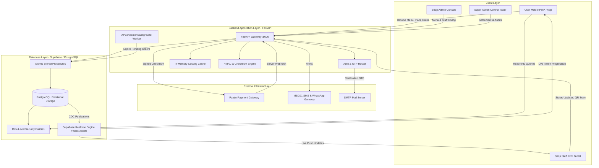
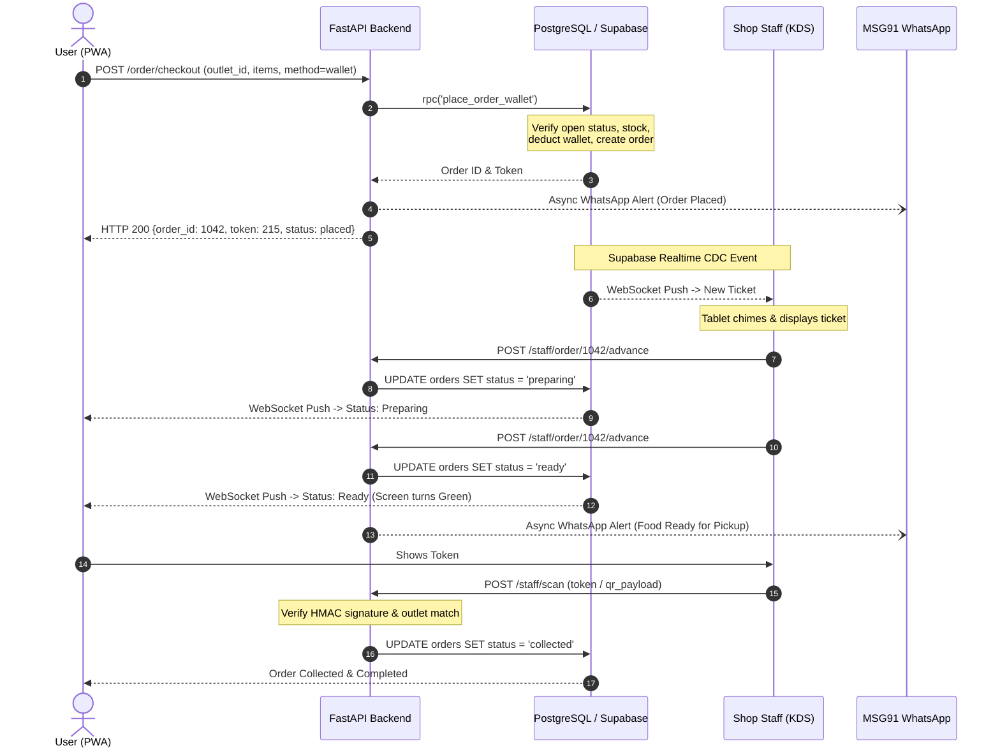
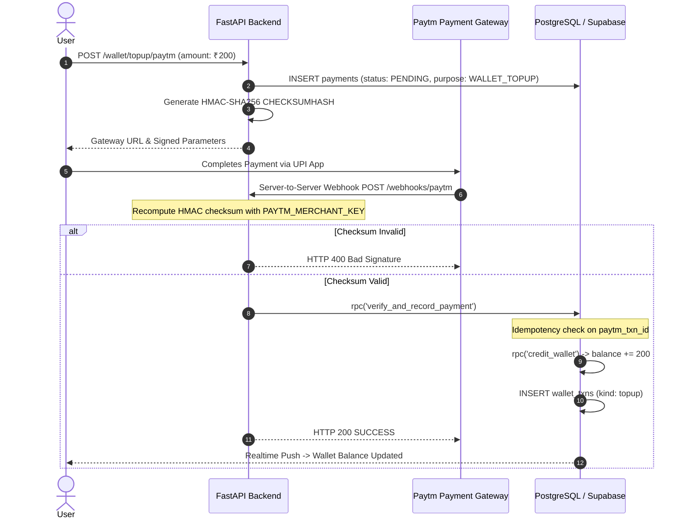

# V Foods: Backend and Database Architecture Specification

A comprehensive technical and functional reference for the V Foods campus dining and food court operating system.

---

## 1. Executive Summary & Project Vision

### 1.1 The Campus Dining Problem
At universities and high-density campuses, dining operations face extreme surge patterns. When lectures conclude, thousands of campus users converge upon food courts, dining halls, and canteens simultaneously during a narrow 15-to-30 minute window.

Traditional campus food ordering suffers from four critical failures:
1. **Physical Counter Congestion**: Users spend 10 to 20 minutes waiting in queue simply to place an order and pay, followed by another 10 to 15 minutes waiting near the counter for their food.
2. **Payment & Cash Friction**: Cash transactions cause coin shortages and slow counter throughput. Card terminals often drop connections indoors. Ad-hoc UPI scanning leads to unverified transfers, falsified screenshots, and lost revenue.
3. **Kitchen Operational Chaos**: Kitchen staff rely on handwritten paper tickets or noisy thermal slips that get lost, grease-stained, or prepared out of sequence.
4. **Inventory and Settlement Discrepancies**: Out-of-stock items continue to be ordered, leading to awkward cancellations and counter disputes. At the end of each day, reconciling revenue between shop owners, campus administration, and service operators is manual, error-prone, and contentious.

### 1.2 The V Foods Solution
**V Foods** is a high-concurrency, queue-free smart campus dining operating system. It coordinates the entire meal lifecycle across four distinct user roles:

```
[ User: Mobile Ordering & Wallet ]
                 |
                 v
[ FastAPI Backend: Verification, Caching, Payments ]
                 |
                 v
[ Supabase PostgreSQL: Atomic Transactions, RLS, Realtime Engine ]
                 |
                 +-----------------------+-----------------------+
                 |                       |                       |
                 v                       v                       v
      [ Shop Staff: Live KDS ]   [ Shop Admin: Ops ]   [ Super Admin: Governance ]
                 |
                 v
  [ Cryptographic QR Verification & Handover ]
```

- **Instant Mobile Ordering**: Users browse live menus, see real-time availability, and order ahead from their devices.
- **Dual Payment Rails**: Users pay either in milliseconds using their prepaid campus wallet or directly via payment gateway (Paytm / UPI).
- **Paperless Kitchen Display System (KDS)**: Kitchens receive orders instantly via real-time WebSockets with live status progression (`Placed` -> `Preparing` -> `Ready` -> `Collected`).
- **Cryptographic Pickup Verification**: Food handover is authenticated using 3-digit daily tokens or HMAC-SHA256 signed QR pickup passes, eliminating stolen food and incorrect handovers.
- **Automated Three-Way Revenue Settlement**: Every completed meal automatically computes and records compliant revenue splits (90% to the Food Shop, 5% to the V Foods Platform, 5% to the University Campus) with zero-penny rounding conservation.

---

## 2. High-Level System Architecture

The V Foods architecture is designed as a decoupled, asynchronous, and resilient distributed system:



---

## 3. Backend Technologies & Tools Explained

Every tool in the V Foods backend is selected for high concurrency, low latency, data integrity, and enterprise security.

### 3.1 FastAPI (Python 3.11)
- **What it is**: A modern, high-performance web framework for building APIs with Python based on standard Python type hints.
- **Role in V Foods**: Acts as the central business logic coordinator, security perimeter, and external integration gateway.
- **Why it was chosen**:
  - **Asynchronous Execution (`async`/`await`)**: Built on top of Starlette and AnyIO, FastAPI handles thousands of concurrent non-blocking requests with minimal CPU and memory footprints.
  - **Native OpenAPI & JSON Schema**: Generates interactive documentation (`/docs`) and typed client schemas automatically.
  - **Dependency Injection System**: Centralizes role-based authorization guards (`get_current_user`, `require_staff`, `require_shop_admin`, `require_admin`).

### 3.2 Uvicorn
- **What it is**: An ultra-fast ASGI (Asynchronous Server Gateway Interface) web server implementation for Python.
- **Role in V Foods**: The production application server running the FastAPI application.
- **Why it was chosen**: Built on `uvloop` (a fast, drop-in replacement for `asyncio` implemented in Cython using `libuv`), Uvicorn delivers raw throughput comparable to Go and Node.js.

### 3.3 Pydantic (v2)
- **What it is**: A data validation and parsing library written in Rust for Python.
- **Role in V Foods**: Validates incoming HTTP payloads, query parameters, and headers before business logic executes.
- **Why it was chosen**: Pydantic v2 enforces strict type contracts, prevents injection attacks, sanitizes inputs, and runs data parsing up to 20 times faster than Pydantic v1.

### 3.4 Supabase Python Client (`supabase-py`)
- **What it is**: The official Python client for interacting with Supabase services.
- **Role in V Foods**: Executes database queries, invokes PostgreSQL stored procedures (RPCs), and manages administrative database calls using the `SUPABASE_SERVICE_ROLE_KEY`.
- **Why it was chosen**: Provides a clean interface for executing complex SQL procedures while maintaining connection pooling to Supabase. The service role key is kept strictly within the backend and is never exposed to client browsers.

### 3.5 Python-Jose & JWT Authentication
- **What it is**: A JavaScript Object Signing and Encryption (JOSE) implementation in Python.
- **Role in V Foods**: Decodes, validates, and cryptographically verifies Supabase JSON Web Tokens (JWTs) presented in the `Authorization: Bearer <token>` HTTP header.
- **Why it was chosen**: Verifies user identity, issuer, expiration, and role claims statelessly without requiring a database query on every protected endpoint.

### 3.6 APScheduler (Advanced Python Scheduler)
- **What it is**: An in-process, asynchronous task scheduling library for Python.
- **Role in V Foods**: Runs background jobs at fixed intervals directly within the FastAPI event loop.
- **Core Task**:
  - **`expire_pending_orders`**: Runs every 5 minutes. Scans for orders that were initiated via payment gateway but never paid within the expiration window. It marks them `cancelled` and returns temporarily held inventory back to the menu.

### 3.7 HTTPX
- **What it is**: A fully featured, asynchronous HTTP client for Python 3 with HTTP/1.1 and HTTP/2 support.
- **Role in V Foods**: Handles outgoing HTTP requests from the backend to external third-party services:
  - Communicating with the Paytm Payment Gateway.
  - Dispatching transactional SMS and WhatsApp notifications to MSG91.

### 3.8 Cryptography & HMAC-SHA256 Engine
- **What it is**: Python's standard `hmac` and `hashlib` modules along with the `cryptography` library.
- **Role in V Foods**:
  - **Paytm Checksum Generation & Verification**: Calculates and verifies HMAC-SHA256 signatures for every payment transaction and incoming webhook.
  - **QR Pickup Pass Signing**: Generates tamper-proof QR payload signatures (`order:<id>:<hmac_hex>`) using a server-side secret key (`QR_SECRET`).
  - **Timing-Attack Resistance**: Uses `hmac.compare_digest` for all signature evaluations to prevent timing attacks.

### 3.9 In-Memory Catalog Caching
- **What it is**: A high-speed caching layer maintained in FastAPI memory (`_CATALOG_CACHE`).
- **Role in V Foods**: Caches the status and summary list of all campus dining outlets (`/api/catalog/summary`) with a 30-second Time-To-Live (TTL).
- **Why it was chosen**: When 1,000+ campus users open the app simultaneously during break, cached catalog requests are served in under 2 milliseconds without querying the database, eliminating database connection exhaustion.

### 3.10 SMTP & Email OTP Verification System
- **What it is**: An email delivery pipeline utilizing Python's `smtplib`, `email.mime`, and `secrets` module.
- **Role in V Foods**: Generates, rate-limits, and verifies 6-digit numeric OTP codes during user signup.
- **Security Features**:
  - 10-minute code expiration.
  - 30-second cooldown between resend requests.
  - 5-attempt brute-force protection lockout.
  - Fallback logging mode for local development and sandbox environments.

### 3.11 MSG91 WhatsApp & SMS Integration
- **What it is**: An enterprise cloud communication platform.
- **Role in V Foods**: Delivers automated, fire-and-forget WhatsApp notifications to users at key moments:
  - Top-up confirmed.
  - Order placed with 3-digit pickup token.
  - Food ready for collection at the counter.
  - Order cancellation or payment failure notification.

---

## 4. Database Architecture & Table Structure Reference (Supabase / PostgreSQL)

The V Foods database is hosted on Supabase and powered by PostgreSQL. It uses relational schemas, constraints, atomic stored procedures, and Row-Level Security (RLS) to enforce data integrity and tenant isolation.

### 4.1 Complete Entity Relationship Diagram (ERD)

```
                    +--------------------------------+
                    |            outlets             |
                    +--------------------------------+
                                   | 1
                                   |
              +--------------------+--------------------+
              | 1                                       | 1
              v 1                                       v *
+--------------------------------+               +--------------------+
|     outlet_paytm_accounts      |               |     menu_items     |
| (per-shop split % & sub-acct)  |               +--------------------+
+--------------------------------+                         |
              ^                                         |
              |                                         v *
              | 1                            +----------------------+
              |                              |     order_items      |
              |                              +----------------------+
              |                                         ^ *
              |                                         | 1
+--------------------------------+               +--------------------+
|         payment_splits         | *           1 |       orders       |
|   (SHOP / PLATFORM / COLLEGE)  |-------------->| (token, status,    |
+--------------------------------+               |  shop_payout, total|
              | *                                |  payment_id FK)    |
              v 1                                +--------------------+
+--------------------------------+                         | 1
|            payments            |<------------------------+
| (Paytm direct order & top-up)  |
+--------------------------------+
              | 1
              v *
+--------------------------------+
|            refunds             |
+--------------------------------+
```

---

### 4.2 Comprehensive Table Structure Reference (All 23 Tables)

Below is the complete, schema-accurate specification for every table in the V Foods database, including its SQL DDL definition, detailed column data dictionary, constraints, indexes, and Row-Level Security (RLS) policies.

---

#### 1. `outlets`
Stores all dining facilities, campus canteens, cafes, food courts, and festival food stalls.

```sql
CREATE TABLE IF NOT EXISTS public.outlets (
  id         text        PRIMARY KEY,
  name       text        NOT NULL,
  location   text        NOT NULL,
  is_event   boolean     NOT NULL DEFAULT false,
  is_open    boolean     NOT NULL DEFAULT true
);
```

| Column Name | Data Type | Nullable? | Default Value | Constraints / Key | Description & Purpose |
|---|---|---|---|---|---|
| `id` | `text` | NO | None | `PRIMARY KEY` | Machine-readable outlet identifier (e.g. `'main-canteen'`, `'gazebo-c1'`, `'tech-cafe'`). |
| `name` | `text` | NO | None | None | Human-readable public display name shown to users. |
| `location` | `text` | NO | None | None | Physical campus location (e.g. `'Central Food Court, Ground Floor'`). |
| `is_event` | `boolean` | NO | `false` | None | Flag indicating whether this outlet is a temporary festival/event food stall. |
| `is_open` | `boolean` | NO | `true` | None | Operational toggle; when `false`, checkout is blocked immediately. |

- **Indexes**: Primary key index on `id`.
- **RLS Policy**: Publicly readable by all users (`anon`, `authenticated`). Writable only by Super Admins.

---

#### 2. `menu_items`
Holds all dishes, drinks, and meals available for purchase across outlets.

```sql
CREATE TABLE IF NOT EXISTS public.menu_items (
  id               bigint      GENERATED ALWAYS AS IDENTITY PRIMARY KEY,
  outlet_id        text        NOT NULL REFERENCES outlets(id) ON DELETE CASCADE,
  name             text        NOT NULL,
  price            int         NOT NULL CHECK (price > 0),
  available        boolean     NOT NULL DEFAULT true,
  is_veg           boolean     NOT NULL DEFAULT true,
  category         text        NOT NULL DEFAULT 'General',
  available_from   time        NULL,
  available_to     time        NULL,
  stock_qty        int         NULL CHECK (stock_qty IS NULL OR stock_qty >= 0),
  reserved_qty     int         NOT NULL DEFAULT 0 CHECK (reserved_qty >= 0)
);
CREATE INDEX IF NOT EXISTS idx_menu_items_outlet ON menu_items(outlet_id);
```

| Column Name | Data Type | Nullable? | Default Value | Constraints / Key | Description & Purpose |
|---|---|---|---|---|---|
| `id` | `bigint` | NO | Identity | `PRIMARY KEY` | Unique autoincrementing food item ID. |
| `outlet_id` | `text` | NO | None | `FK -> outlets(id) ON DELETE CASCADE` | The outlet that produces and sells this item. |
| `name` | `text` | NO | None | None | Name of the dish or drink (e.g. `'Paneer Butter Masala Roll'`). |
| `price` | `int` | NO | None | `CHECK (price > 0)` | Base unit price in Indian Rupees (INR). |
| `available` | `boolean` | NO | `true` | None | Immediate stock toggle; flips to `false` when sold out. |
| `is_veg` | `boolean` | NO | `true` | None | Dietary flag (true for vegetarian, false for non-vegetarian). |
| `category` | `text` | NO | `'General'` | None | Menu category for tabbed browsing (e.g. `'Breakfast'`, `'Beverages'`). |
| `available_from` | `time` | YES | `NULL` | None | Optional daily time restriction window start (e.g. `08:00:00`). |
| `available_to` | `time` | YES | `NULL` | None | Optional daily time restriction window end (e.g. `11:30:00`). |
| `stock_qty` | `int` | YES | `NULL` | `CHECK (stock_qty IS NULL OR stock_qty >= 0)` | Remaining portions available today; `NULL` means unlimited. |
| `reserved_qty` | `int` | NO | `0` | `CHECK (reserved_qty >= 0)` | Portions temporarily held during active payment sessions. |

- **Indexes**: `idx_menu_items_outlet` on `outlet_id`.
- **RLS Policy**: Publicly readable. Writable by Shop Admins and Staff belonging to the same `outlet_id`.

---

#### 3. `profiles`
User profiles extending Supabase's native `auth.users` authentication table.

```sql
CREATE TABLE IF NOT EXISTS public.profiles (
  id             uuid        PRIMARY KEY REFERENCES auth.users(id) ON DELETE CASCADE,
  full_name      text        NOT NULL DEFAULT '',
  role           user_role   NOT NULL DEFAULT 'customer',
  cust_type      cust_type   NOT NULL DEFAULT 'student',
  outlet_id      text        NULL REFERENCES outlets(id) ON DELETE SET NULL,
  phone          text        NULL,
  referral_code  text        NULL UNIQUE,
  added_by       uuid        NULL REFERENCES profiles(id) ON DELETE SET NULL,
  created_at     timestamptz NOT NULL DEFAULT now()
);
```

| Column Name | Data Type | Nullable? | Default Value | Constraints / Key | Description & Purpose |
|---|---|---|---|---|---|
| `id` | `uuid` | NO | None | `PK, FK -> auth.users(id) ON DELETE CASCADE` | Maps 1:1 with Supabase Auth credentials. |
| `full_name` | `text` | NO | `''` | None | User's full legal name. |
| `role` | `user_role` ENUM | NO | `'customer'` | Enum: `customer`, `staff`, `shop_admin`, `super_admin`, `admin` | System permission tier for role-based access control. |
| `cust_type` | `cust_type` ENUM | NO | `'student'` | Enum: `student`, `faculty`, `visitor` | Campus classification for reporting. |
| `outlet_id` | `text` | YES | `NULL` | `FK -> outlets(id) ON DELETE SET NULL` | Assigned food stall for staff and shop owners. |
| `phone` | `text` | YES | `NULL` | None | Mobile phone number used for SMS/WhatsApp pickup alerts. |
| `referral_code` | `text` | YES | `NULL` | `UNIQUE` | Unique referral token assigned to users to invite friends. |
| `added_by` | `uuid` | YES | `NULL` | `FK -> profiles(id)` | Administrator ID who created or invited this user. |
| `created_at` | `timestamptz` | NO | `now()` | None | Account creation timestamp. |

- **RLS Policy**: Users can read and update their own profile (`id = auth.uid()`). Super Admins can view all.

---

#### 4. `wallets`
Prepaid digital campus wallet balances.

```sql
CREATE TABLE IF NOT EXISTS public.wallets (
  user_id     uuid        PRIMARY KEY REFERENCES profiles(id) ON DELETE CASCADE,
  balance     int         NOT NULL DEFAULT 0 CHECK (balance >= 0),
  updated_at  timestamptz NOT NULL DEFAULT now()
);
```

| Column Name | Data Type | Nullable? | Default Value | Constraints / Key | Description & Purpose |
|---|---|---|---|---|---|
| `user_id` | `uuid` | NO | None | `PK, FK -> profiles(id) ON DELETE CASCADE` | Wallet owner identifier. |
| `balance` | `int` | NO | `0` | `CHECK (balance >= 0)` | Available stored value balance in INR. Cannot be negative. |
| `updated_at` | `timestamptz` | NO | `now()` | None | Timestamp of last credit or debit operation. |

- **RLS Policy**: Users can SELECT only their own wallet (`user_id = auth.uid()`). Direct client INSERT/UPDATE is strictly forbidden; balance changes must execute through server RPCs.

---

#### 5. `wallet_txns`
Immutable audit ledger tracking every balance change.

```sql
CREATE TABLE IF NOT EXISTS public.wallet_txns (
  id          bigint      GENERATED ALWAYS AS IDENTITY PRIMARY KEY,
  user_id     uuid        NOT NULL REFERENCES profiles(id) ON DELETE CASCADE,
  amount      int         NOT NULL,
  kind        text        NOT NULL CHECK (kind IN ('topup','order','refund','admin_credit','referral_bonus')),
  ref         text        NOT NULL UNIQUE,
  note        text        NULL,
  created_at  timestamptz NOT NULL DEFAULT now()
);
CREATE INDEX IF NOT EXISTS idx_wallet_txns_user ON wallet_txns(user_id, created_at DESC);
```

| Column Name | Data Type | Nullable? | Default Value | Constraints / Key | Description & Purpose |
|---|---|---|---|---|---|
| `id` | `bigint` | NO | Identity | `PRIMARY KEY` | Global unique transaction identifier. |
| `user_id` | `uuid` | NO | None | `FK -> profiles(id) ON DELETE CASCADE` | User account whose balance was adjusted. |
| `amount` | `int` | NO | None | None | Value change in INR (positive for credits, negative for debits). |
| `kind` | `text` | NO | None | `CHECK (kind IN (...))` | Nature of transaction: `'topup'`, `'order'`, `'refund'`, etc. |
| `ref` | `text` | NO | None | `UNIQUE` | Idempotency key (e.g. `'paytm:TXN102'`, `'order:450'`). |
| `note` | `text` | YES | `NULL` | None | Human-readable explanation for receipts and statements. |
| `created_at` | `timestamptz` | NO | `now()` | None | Transaction execution timestamp. |

- **Indexes**: `idx_wallet_txns_user` on `(user_id, created_at DESC)`.
- **RLS Policy**: Users can read only their own transactions. Append-only; `UPDATE` and `DELETE` are disabled.

---

#### 6. `orders`
Master operational record for every food and beverage order.

```sql
CREATE TABLE IF NOT EXISTS public.orders (
  id              bigint          GENERATED ALWAYS AS IDENTITY PRIMARY KEY,
  user_id         uuid            NOT NULL REFERENCES profiles(id) ON DELETE RESTRICT,
  outlet_id       text            NOT NULL REFERENCES outlets(id) ON DELETE RESTRICT,
  token           text            NULL,
  status          order_status    NOT NULL DEFAULT 'payment_pending',
  payment_method  payment_method  NOT NULL DEFAULT 'wallet',
  shop_payout     int             NOT NULL CHECK (shop_payout > 0),
  total           int             NOT NULL CHECK (total > 0),
  my_profit       int             GENERATED ALWAYS AS (shop_payout * 5 / 100) STORED,
  payment_id      bigint          NULL REFERENCES payments(id) ON DELETE SET NULL,
  pickup_slot_id  uuid            NULL REFERENCES pickup_slots(id) ON DELETE SET NULL,
  cancel_reason   text            NULL,
  expires_at      timestamptz     NULL,
  created_at      timestamptz     NOT NULL DEFAULT now(),
  updated_at      timestamptz     NOT NULL DEFAULT now()
);
CREATE INDEX IF NOT EXISTS idx_orders_user    ON orders(user_id, created_at DESC);
CREATE INDEX IF NOT EXISTS idx_orders_outlet  ON orders(outlet_id, created_at DESC);
CREATE INDEX IF NOT EXISTS idx_orders_status  ON orders(status);
```

| Column Name | Data Type | Nullable? | Default Value | Constraints / Key | Description & Purpose |
|---|---|---|---|---|---|
| `id` | `bigint` | NO | Identity | `PRIMARY KEY` | Global unique order ID. |
| `user_id` | `uuid` | NO | None | `FK -> profiles(id) ON DELETE RESTRICT` | User who placed the order. |
| `outlet_id` | `text` | NO | None | `FK -> outlets(id) ON DELETE RESTRICT` | Food stall fulfilling the order. |
| `token` | `text` | YES | `NULL` | None | 3-digit pickup code (e.g. `'142'`) issued upon confirmed payment. |
| `status` | `order_status` ENUM | NO | `'payment_pending'` | Enum: `payment_pending`, `placed`, `preparing`, `ready`, `collected`, `cancelled` | Live lifecycle state of the order. |
| `payment_method` | `payment_method` ENUM | NO | `'wallet'` | Enum: `wallet`, `gateway` | Payment mechanism used. |
| `shop_payout` | `int` | NO | None | `CHECK (shop_payout > 0)` | Net food item subtotal due to the shop. |
| `total` | `int` | NO | None | `CHECK (total > 0)` | Final amount billed to user (items + convenience fees). |
| `my_profit` | `int` | NO | Stored Gen | `(shop_payout * 5 / 100)` | 5% platform fee stored automatically. |
| `payment_id` | `bigint` | YES | `NULL` | `FK -> payments(id)` | Foreign key linking to the underlying gateway payment. |
| `pickup_slot_id`| `uuid` | YES | `NULL` | `FK -> pickup_slots(id)` | Scheduled pickup time window if pre-ordered. |
| `cancel_reason` | `text` | YES | `NULL` | None | Explanatory note if rejected or cancelled. |
| `expires_at` | `timestamptz` | YES | `NULL` | None | Automatic cancellation timestamp for pending gateway checkouts. |
| `created_at` | `timestamptz` | NO | `now()` | None | Order creation timestamp. |
| `updated_at` | `timestamptz` | NO | `now()` | None | Last status update timestamp. |

- **RLS Policy**: Users view their own orders (`user_id = auth.uid()`). Kitchen staff view only orders for their own `outlet_id`. Super Admins view all.

---

#### 7. `order_items`
Individual line items inside an order with frozen price snapshots.

```sql
CREATE TABLE IF NOT EXISTS public.order_items (
  order_id  bigint  NOT NULL REFERENCES orders(id) ON DELETE CASCADE,
  item_id   bigint  NOT NULL REFERENCES menu_items(id) ON DELETE RESTRICT,
  name      text    NOT NULL,
  price     int     NOT NULL,
  qty       int     NOT NULL CHECK (qty > 0),
  PRIMARY KEY (order_id, item_id)
);
CREATE INDEX IF NOT EXISTS idx_order_items_order ON order_items(order_id);
```

| Column Name | Data Type | Nullable? | Default Value | Constraints / Key | Description & Purpose |
|---|---|---|---|---|---|
| `order_id` | `bigint` | NO | None | `PK (composite), FK -> orders(id) ON DELETE CASCADE` | Parent order reference. |
| `item_id` | `bigint` | NO | None | `PK (composite), FK -> menu_items(id) ON DELETE RESTRICT` | Referenced dish from menu. |
| `name` | `text` | NO | None | None | Frozen dish title snapshot at the time order was placed. |
| `price` | `int` | NO | None | None | Frozen unit price in INR at purchase time. |
| `qty` | `int` | NO | None | `CHECK (qty > 0)` | Number of portions ordered. |

- **RLS Policy**: Inherits access rules from parent `orders` table.

---

#### 8. `payments`
Unified ledger of all payment attempts across both Wallet Top-Up and Direct Order Checkout.

```sql
CREATE TABLE IF NOT EXISTS public.payments (
  id                bigint          GENERATED ALWAYS AS IDENTITY PRIMARY KEY,
  user_id           uuid            NOT NULL REFERENCES profiles(id) ON DELETE RESTRICT,
  order_id          bigint          NULL REFERENCES orders(id) ON DELETE SET NULL,
  wallet_txn_id     bigint          NULL REFERENCES wallet_txns(id) ON DELETE SET NULL,
  amount            numeric         NOT NULL CHECK (amount > 0),
  payment_purpose   text            NOT NULL CHECK (payment_purpose IN ('ORDER', 'WALLET_TOPUP')),
  payment_method    text            NOT NULL CHECK (payment_method IN ('UPI_ID', 'UPI_APP', 'UPI_QR', 'DEBIT_CARD', 'CREDIT_CARD', 'WALLET')),
  status            text            NOT NULL DEFAULT 'PENDING' CHECK (status IN ('PENDING', 'SUCCESS', 'FAILED', 'CANCELLED', 'REFUNDED')),
  paytm_order_id    text            NULL,
  paytm_txn_id      text            NULL UNIQUE,
  payment_reference text            NULL,
  paid_at           timestamptz     NULL,
  failure_reason    text            NULL,
  created_at        timestamptz     NOT NULL DEFAULT now(),
  updated_at        timestamptz     NOT NULL DEFAULT now()
);
CREATE INDEX IF NOT EXISTS idx_payments_user_id ON payments(user_id);
CREATE INDEX IF NOT EXISTS idx_payments_order_id ON payments(order_id);
CREATE INDEX IF NOT EXISTS idx_payments_status ON payments(status);
```

| Column Name | Data Type | Nullable? | Default Value | Constraints / Key | Description & Purpose |
|---|---|---|---|---|---|
| `id` | `bigint` | NO | Identity | `PRIMARY KEY` | Global payment ledger identifier. |
| `user_id` | `uuid` | NO | None | `FK -> profiles(id) ON DELETE RESTRICT` | Payer user account. |
| `order_id` | `bigint` | YES | `NULL` | `FK -> orders(id) ON DELETE SET NULL` | Target order ID (NULL for wallet top-up). |
| `wallet_txn_id` | `bigint` | YES | `NULL` | `FK -> wallet_txns(id) ON DELETE SET NULL` | Linked wallet ledger entry. |
| `amount` | `numeric` | NO | None | `CHECK (amount > 0)` | Total monetary transaction amount in INR. |
| `payment_purpose`| `text` | NO | None | `CHECK in ('ORDER', 'WALLET_TOPUP')` | Business purpose of payment. |
| `payment_method` | `text` | NO | None | `CHECK in ('UPI_APP', 'DEBIT_CARD', ...)` | Payment rail used by customer. |
| `status` | `text` | NO | `'PENDING'` | `CHECK in ('PENDING', 'SUCCESS', ...)` | Bank reconciliation status. |
| `paytm_order_id` | `text` | YES | `NULL` | None | Merchant transaction reference sent to gateway. |
| `paytm_txn_id` | `text` | YES | `NULL` | `UNIQUE` | Bank transaction ID returned in verified webhook; acts as idempotency key. |
| `payment_reference`| `text` | YES | `NULL` | None | Internal tracking reference string. |
| `paid_at` | `timestamptz` | YES | `NULL` | None | Timestamp when verified as SUCCESS. |
| `failure_reason` | `text` | YES | `NULL` | None | Detailed gateway error message if failed. |
| `created_at` / `updated_at` | `timestamptz` | NO | `now()` | None | Audit timestamps. |

- **RLS Policy**: Users view only their own payments. Staff view payments linked to orders at their outlet. Super Admins view all.

---

#### 9. `outlet_paytm_accounts`
Per-shop recipient sub-accounts with outlet-configurable split shares.

```sql
CREATE TABLE IF NOT EXISTS public.outlet_paytm_accounts (
  outlet_id               text            PRIMARY KEY REFERENCES outlets(id) ON DELETE CASCADE,
  paytm_account_id        text            NOT NULL,
  onboarding_status       text            NOT NULL DEFAULT 'PENDING' CHECK (onboarding_status IN ('PENDING', 'ACTIVE', 'REJECTED')),
  settlement_enabled      boolean         NOT NULL DEFAULT false,
  shop_split_percentage   numeric         NOT NULL DEFAULT 90 CHECK (shop_split_percentage >= 0 AND shop_split_percentage <= 100),
  created_at              timestamptz     NOT NULL DEFAULT now(),
  updated_at              timestamptz     NOT NULL DEFAULT now()
);
```

| Column Name | Data Type | Nullable? | Default Value | Constraints / Key | Description & Purpose |
|---|---|---|---|---|---|
| `outlet_id` | `text` | NO | None | `PK, FK -> outlets(id) ON DELETE CASCADE` | Target food outlet. |
| `paytm_account_id` | `text` | NO | None | None | Registered Paytm Merchant sub-account ID. |
| `onboarding_status`| `text` | NO | `'PENDING'` | `CHECK in ('PENDING', 'ACTIVE', 'REJECTED')` | Gateway KYC and onboarding approval status. |
| `settlement_enabled`| `boolean` | NO | `false` | None | Master disbursement toggle. |
| `shop_split_percentage`| `numeric`| NO | `90` | `CHECK (0 <= shop_split_percentage <= 100)` | Negotiated shop percentage (default 90%). |
| `created_at` / `updated_at` | `timestamptz` | NO | `now()` | None | Audit timestamps. |

- **Triggers**: Validated by `trg_validate_outlet_split` guaranteeing $Shop\% + Platform\% + College\% = 100\%$.
- **RLS Policy**: Shop Admins can inspect their own outlet's account. Super Admins manage all.

---

#### 10. `platform_settlement_account`
Startup platform settlement account (singleton row `id = 1`).

```sql
CREATE TABLE IF NOT EXISTS public.platform_settlement_account (
  id                          int             PRIMARY KEY DEFAULT 1 CHECK (id = 1),
  paytm_account_id            text            NOT NULL,
  settlement_enabled          boolean         NOT NULL DEFAULT false,
  platform_split_percentage   numeric         NOT NULL DEFAULT 5 CHECK (platform_split_percentage >= 0 AND platform_split_percentage <= 100),
  created_at                  timestamptz     NOT NULL DEFAULT now(),
  updated_at                  timestamptz     NOT NULL DEFAULT now()
);
```

| Column Name | Data Type | Nullable? | Default Value | Constraints / Key | Description & Purpose |
|---|---|---|---|---|---|
| `id` | `int` | NO | `1` | `PK, CHECK (id = 1)` | Singleton identifier enforcing exactly one row. |
| `paytm_account_id` | `text` | NO | None | None | V Foods company settlement merchant ID. |
| `settlement_enabled`| `boolean`| NO | `false` | None | Platform disbursement switch. |
| `platform_split_percentage`| `numeric`| NO | `5` | `CHECK (0 <= pct <= 100)` | Fixed platform fee percentage (**5%**). |
| `created_at` / `updated_at` | `timestamptz` | NO | `now()` | None | Audit timestamps. |

- **RLS Policy**: Restricted exclusively to Super Admins.

---

#### 11. `college_settlement_accounts`
Campus university institution settlement accounts (one active row per campus).

```sql
CREATE TABLE IF NOT EXISTS public.college_settlement_accounts (
  id                          bigint          GENERATED ALWAYS AS IDENTITY PRIMARY KEY,
  campus_name                 text            NOT NULL,
  paytm_account_id            text            NOT NULL,
  onboarding_status           text            NOT NULL DEFAULT 'PENDING' CHECK (onboarding_status IN ('PENDING', 'ACTIVE', 'REJECTED')),
  settlement_enabled          boolean         NOT NULL DEFAULT false,
  is_active                   boolean         NOT NULL DEFAULT true,
  college_split_percentage    numeric         NOT NULL DEFAULT 5 CHECK (college_split_percentage >= 0 AND college_split_percentage <= 100),
  created_at                  timestamptz     NOT NULL DEFAULT now(),
  updated_at                  timestamptz     NOT NULL DEFAULT now()
);
CREATE UNIQUE INDEX IF NOT EXISTS idx_college_single_active ON college_settlement_accounts(is_active) WHERE is_active = true;
```

| Column Name | Data Type | Nullable? | Default Value | Constraints / Key | Description & Purpose |
|---|---|---|---|---|---|
| `id` | `bigint` | NO | Identity | `PRIMARY KEY` | Unique campus settlement record ID. |
| `campus_name` | `text` | NO | None | None | Host institution name (e.g. `'VIT Chennai'`). |
| `paytm_account_id` | `text` | NO | None | None | University banking settlement merchant ID. |
| `onboarding_status`| `text` | NO | `'PENDING'` | `CHECK in ('PENDING', 'ACTIVE', 'REJECTED')` | Institutional KYC status. |
| `settlement_enabled`| `boolean`| NO | `false` | None | University disbursement switch. |
| `is_active` | `boolean` | NO | `true` | None | Active campus flag. |
| `college_split_percentage`| `numeric`| NO | `5` | `CHECK (0 <= pct <= 100)` | University campus royalty percentage (**5%**). |
| `created_at` / `updated_at` | `timestamptz` | NO | `now()` | None | Audit timestamps. |

- **Indexes**: Unique partial index `idx_college_single_active` enforces that only one campus row is active at a time.
- **RLS Policy**: Restricted exclusively to Super Admins.

---

#### 12. `payment_splits`
Individual settlement payouts computed for every completed meal.

```sql
CREATE TABLE IF NOT EXISTS public.payment_splits (
  id                          bigint          GENERATED ALWAYS AS IDENTITY PRIMARY KEY,
  payment_id                  bigint          NOT NULL REFERENCES payments(id) ON DELETE CASCADE,
  recipient_type              text            NOT NULL CHECK (recipient_type IN ('SHOP', 'PLATFORM', 'COLLEGE')),
  outlet_paytm_account_id     text            NULL REFERENCES outlet_paytm_accounts(outlet_id) ON DELETE RESTRICT,
  platform_account_id         int             NULL REFERENCES platform_settlement_account(id) ON DELETE RESTRICT,
  college_account_id          bigint          NULL REFERENCES college_settlement_accounts(id) ON DELETE RESTRICT,
  split_amount                numeric         NOT NULL CHECK (split_amount >= 0),
  split_percentage            numeric         NULL CHECK (split_percentage IS NULL OR (split_percentage >= 0 AND split_percentage <= 100)),
  settlement_status           text            NOT NULL DEFAULT 'PENDING' CHECK (settlement_status IN ('PENDING', 'SETTLED', 'FAILED')),
  settlement_reference        text            NULL,
  settled_at                  timestamptz     NULL,
  created_at                  timestamptz     NOT NULL DEFAULT now(),
  CONSTRAINT chk_split_recipient_account CHECK (
    (recipient_type = 'SHOP' AND outlet_paytm_account_id IS NOT NULL AND platform_account_id IS NULL AND college_account_id IS NULL) OR
    (recipient_type = 'PLATFORM' AND platform_account_id IS NOT NULL AND outlet_paytm_account_id IS NULL AND college_account_id IS NULL) OR
    (recipient_type = 'COLLEGE' AND college_account_id IS NOT NULL AND outlet_paytm_account_id IS NULL AND platform_account_id IS NULL)
  )
);
CREATE INDEX IF NOT EXISTS idx_payment_splits_payment_id ON payment_splits(payment_id);
CREATE INDEX IF NOT EXISTS idx_payment_splits_recipient ON payment_splits(recipient_type);
```

| Column Name | Data Type | Nullable? | Default Value | Constraints / Key | Description & Purpose |
|---|---|---|---|---|---|
| `id` | `bigint` | NO | Identity | `PRIMARY KEY` | Unique split payout identifier. |
| `payment_id` | `bigint` | NO | None | `FK -> payments(id) ON DELETE CASCADE` | Source payment being disbursed. |
| `recipient_type` | `text` | NO | None | `CHECK in ('SHOP', 'PLATFORM', 'COLLEGE')` | Category of recipient receiving the share. |
| `outlet_paytm_account_id`| `text` | YES | `NULL` | `FK -> outlet_paytm_accounts(outlet_id)` | Populated only when `recipient_type = 'SHOP'`. |
| `platform_account_id`| `int` | YES | `NULL` | `FK -> platform_settlement_account(id)` | Populated only when `recipient_type = 'PLATFORM'`. |
| `college_account_id` | `bigint` | YES | `NULL` | `FK -> college_settlement_accounts(id)` | Populated only when `recipient_type = 'COLLEGE'`. |
| `split_amount` | `numeric` | NO | None | `CHECK (split_amount >= 0)` | Disbursed amount in INR. |
| `split_percentage` | `numeric` | YES | `NULL` | `CHECK (0 <= split_percentage <= 100)` | Applicable percentage share applied. |
| `settlement_status`| `text` | NO | `'PENDING'` | `CHECK in ('PENDING', 'SETTLED', 'FAILED')`| Bank disbursement status. |
| `settlement_reference`| `text` | YES | `NULL` | None | Paytm disbursement UTR/reference code. |
| `settled_at` | `timestamptz` | YES | `NULL` | None | Disbursement timestamp. |
| `created_at` | `timestamptz` | NO | `now()` | None | Creation timestamp. |

- **RLS Policy**: Shop Admins can view only their own outlet's `'SHOP'` split rows. Super Admins view all. Users have zero access.

---

#### 13. `refunds`
Audit log of processed and pending customer refunds.

```sql
CREATE TABLE IF NOT EXISTS public.refunds (
  id                bigint          GENERATED ALWAYS AS IDENTITY PRIMARY KEY,
  payment_id        bigint          NOT NULL REFERENCES payments(id) ON DELETE RESTRICT,
  order_id          bigint          NULL REFERENCES orders(id) ON DELETE SET NULL,
  wallet_txn_id     bigint          NULL REFERENCES wallet_txns(id) ON DELETE SET NULL,
  refund_type       text            NOT NULL CHECK (refund_type IN ('ORDER_REFUND', 'WALLET_TOPUP_REFUND', 'SPLIT_REFUND')),
  amount            numeric         NOT NULL CHECK (amount > 0),
  status            text            NOT NULL DEFAULT 'PENDING' CHECK (status IN ('PENDING', 'SUCCESS', 'FAILED')),
  paytm_refund_id   text            NULL,
  reason            text            NULL,
  created_at        timestamptz     NOT NULL DEFAULT now(),
  processed_at      timestamptz     NULL
);
```

| Column Name | Data Type | Nullable? | Default Value | Constraints / Key | Description & Purpose |
|---|---|---|---|---|---|
| `id` | `bigint` | NO | Identity | `PRIMARY KEY` | Unique refund record ID. |
| `payment_id` | `bigint` | NO | None | `FK -> payments(id) ON DELETE RESTRICT` | Source payment being refunded. |
| `order_id` | `bigint` | YES | `NULL` | `FK -> orders(id) ON DELETE SET NULL` | Linked order ID if an order was cancelled. |
| `wallet_txn_id` | `bigint` | YES | `NULL` | `FK -> wallet_txns(id) ON DELETE SET NULL` | Linked wallet debit if refunding a top-up. |
| `refund_type` | `text` | NO | None | `CHECK in ('ORDER_REFUND', ...)` | Reason and path of refund. |
| `amount` | `numeric` | NO | None | `CHECK (amount > 0)` | Refunded amount in INR. |
| `status` | `text` | NO | `'PENDING'` | `CHECK in ('PENDING', 'SUCCESS', 'FAILED')`| Gateway refund progress status. |
| `paytm_refund_id`| `text` | YES | `NULL` | None | Gateway refund transaction reference. |
| `reason` | `text` | YES | `NULL` | None | Administrative or operational reason. |
| `created_at` / `processed_at` | `timestamptz` | YES/NO | `now()` / `NULL` | None | Timestamps. |

- **RLS Policy**: Users view their own refunds. Staff view refunds for orders at their shop. Super Admins view all.

---

#### 14. `item_ratings`
Customer ratings and reviews for individual menu items.

```sql
CREATE TABLE IF NOT EXISTS public.item_ratings (
  id         bigint      GENERATED ALWAYS AS IDENTITY PRIMARY KEY,
  order_id   bigint      NOT NULL REFERENCES orders(id) ON DELETE CASCADE,
  item_id    bigint      NOT NULL REFERENCES menu_items(id) ON DELETE CASCADE,
  user_id    uuid        NOT NULL REFERENCES profiles(id) ON DELETE CASCADE,
  rating     smallint    NOT NULL CHECK (rating BETWEEN 1 AND 5),
  comment    text        NULL,
  created_at timestamptz NOT NULL DEFAULT now(),
  CONSTRAINT uq_order_item_user_rating UNIQUE (order_id, item_id, user_id)
);
```

| Column Name | Data Type | Nullable? | Default Value | Constraints / Key | Description & Purpose |
|---|---|---|---|---|---|
| `id` | `bigint` | NO | Identity | `PRIMARY KEY` | Rating record identifier. |
| `order_id` | `bigint` | NO | None | `FK -> orders(id) ON DELETE CASCADE` | Source order confirming item was ordered. |
| `item_id` | `bigint` | NO | None | `FK -> menu_items(id) ON DELETE CASCADE` | Dish being evaluated. |
| `user_id` | `uuid` | NO | None | `FK -> profiles(id) ON DELETE CASCADE` | User submitting the review. |
| `rating` | `smallint` | NO | None | `CHECK (rating BETWEEN 1 AND 5)` | 1-to-5 star quality score. |
| `comment` | `text` | YES | `NULL` | None | Optional user feedback comment. |
| `created_at` | `timestamptz` | NO | `now()` | None | Timestamp when rating was submitted. |

- **Triggers**: Enforced by `trg_check_item_rating_order_status` requiring `order.status = 'collected'` before a review can be submitted.
- **RLS Policy**: Read access is public. Insert access restricted to order owner.

---

#### 15. `loyalty_progress`
Tracks order completion streaks and automated loyalty reward milestones.

```sql
CREATE TABLE IF NOT EXISTS public.loyalty_progress (
  user_id             uuid        PRIMARY KEY REFERENCES profiles(id) ON DELETE CASCADE,
  completed_orders    int         NOT NULL DEFAULT 0 CHECK (completed_orders >= 0),
  free_items_earned   int         NOT NULL DEFAULT 0 CHECK (free_items_earned >= 0),
  free_items_redeemed int         NOT NULL DEFAULT 0 CHECK (free_items_redeemed >= 0),
  updated_at          timestamptz NOT NULL DEFAULT now()
);
```

| Column Name | Data Type | Nullable? | Default Value | Constraints / Key | Description & Purpose |
|---|---|---|---|---|---|
| `user_id` | `uuid` | NO | None | `PK, FK -> profiles(id) ON DELETE CASCADE` | User account tracking loyalty. |
| `completed_orders` | `int` | NO | `0` | `CHECK (completed_orders >= 0)` | Cumulative count of orders marked `'collected'`. |
| `free_items_earned` | `int` | NO | `0` | `CHECK (free_items_earned >= 0)` | Free items earned (1 every 10 completed orders). |
| `free_items_redeemed`| `int` | NO | `0` | `CHECK (free_items_redeemed >= 0)` | Free items redeemed by user. |
| `updated_at` | `timestamptz` | NO | `now()` | None | Timestamp of last order completion. |

- **Triggers**: Automatically updated by `trg_increment_loyalty` whenever an order transitions to `'collected'`.
- **RLS Policy**: Users can read only their own loyalty progress (`user_id = auth.uid()`).

---

#### 16. `referrals`
Tracks user referrals and automated ₹30 wallet bonuses upon first completed order.

```sql
CREATE TABLE IF NOT EXISTS public.referrals (
  id              uuid        PRIMARY KEY DEFAULT gen_random_uuid(),
  referrer_id     uuid        NOT NULL REFERENCES profiles(id) ON DELETE CASCADE,
  referred_id     uuid        NOT NULL UNIQUE REFERENCES profiles(id) ON DELETE CASCADE,
  status          text        NOT NULL DEFAULT 'pending' CHECK (status IN ('pending', 'completed')),
  reward_credited bool        NOT NULL DEFAULT false,
  created_at      timestamptz NOT NULL DEFAULT now()
);
```

| Column Name | Data Type | Nullable? | Default Value | Constraints / Key | Description & Purpose |
|---|---|---|---|---|---|
| `id` | `uuid` | NO | `gen_random_uuid()` | `PRIMARY KEY` | Unique referral relationship ID. |
| `referrer_id` | `uuid` | NO | None | `FK -> profiles(id) ON DELETE CASCADE` | User who shared their referral code. |
| `referred_id` | `uuid` | NO | None | `UNIQUE, FK -> profiles(id) ON DELETE CASCADE` | New user who registered with the referral code. |
| `status` | `text` | NO | `'pending'` | `CHECK in ('pending', 'completed')` | State of referral. |
| `reward_credited`| `bool` | NO | `false` | None | Flag preventing double payout of referral bonuses. |
| `created_at` | `timestamptz` | NO | `now()` | None | Timestamp when referral was linked. |

- **Triggers**: Managed by `trg_reward_referral`; credits ₹30 to both wallets when the new user completes their first order.
- **RLS Policy**: Users view referrals where they are either the referrer or referred.

---

#### 17. `pickup_slots`
Scheduled pickup time windows for pacing counter rush traffic.

```sql
CREATE TABLE IF NOT EXISTS public.pickup_slots (
  id              uuid        PRIMARY KEY DEFAULT gen_random_uuid(),
  outlet_id       text        NOT NULL REFERENCES outlets(id) ON DELETE CASCADE,
  slot_time       timestamptz NOT NULL,
  max_orders      int         NOT NULL DEFAULT 15 CHECK (max_orders > 0),
  current_orders  int         NOT NULL DEFAULT 0 CHECK (current_orders >= 0),
  CONSTRAINT uq_outlet_slot_time UNIQUE (outlet_id, slot_time)
);
```

| Column Name | Data Type | Nullable? | Default Value | Constraints / Key | Description & Purpose |
|---|---|---|---|---|---|
| `id` | `uuid` | NO | `gen_random_uuid()` | `PRIMARY KEY` | Pickup slot ID. |
| `outlet_id` | `text` | NO | None | `FK -> outlets(id) ON DELETE CASCADE` | Outlet offering the slot. |
| `slot_time` | `timestamptz` | NO | None | None | Exact scheduled pickup time (e.g. `12:30 PM`). |
| `max_orders` | `int` | NO | `15` | `CHECK (max_orders > 0)` | Maximum orders allowed in this slot. |
| `current_orders` | `int` | NO | `0` | `CHECK (current_orders >= 0)` | Booked order count. |

- **RLS Policy**: Publicly readable. Managed by Shop Admins and Staff.

---

#### 18. `coupons`
Promotional discount codes with usage limits and date windows.

```sql
CREATE TABLE IF NOT EXISTS public.coupons (
  code            text        PRIMARY KEY,
  discount_type   text        NOT NULL CHECK (discount_type IN ('flat', 'percent')),
  discount_value  numeric     NOT NULL CHECK (discount_value > 0),
  min_order_value int         NULL CHECK (min_order_value IS NULL OR min_order_value > 0),
  max_uses        int         NULL CHECK (max_uses IS NULL OR max_uses > 0),
  used_count      int         NOT NULL DEFAULT 0 CHECK (used_count >= 0),
  outlet_id       text        NULL REFERENCES outlets(id) ON DELETE CASCADE,
  valid_from      timestamptz NOT NULL DEFAULT now(),
  valid_to        timestamptz NOT NULL DEFAULT (now() + interval '30 days'),
  active          bool        NOT NULL DEFAULT true
);
```

| Column Name | Data Type | Nullable? | Default Value | Constraints / Key | Description & Purpose |
|---|---|---|---|---|---|
| `code` | `text` | NO | None | `PRIMARY KEY` | Uppercase coupon voucher code (e.g. `'CAMPUS50'`). |
| `discount_type` | `text` | NO | None | `CHECK in ('flat', 'percent')` | Discount mode (flat rupees or percentage off). |
| `discount_value` | `numeric` | NO | None | `CHECK (discount_value > 0)` | Discount amount or percentage value. |
| `min_order_value`| `int` | YES | `NULL` | `CHECK (min_order_value > 0)` | Minimum item subtotal required to apply. |
| `max_uses` | `int` | YES | `NULL` | `CHECK (max_uses > 0)` | Total redemptions allowed across platform. |
| `used_count` | `int` | NO | `0` | `CHECK (used_count >= 0)` | Count of orders that have redeemed this coupon. |
| `outlet_id` | `text` | YES | `NULL` | `FK -> outlets(id)` | Restricts coupon to one stall (`NULL` = platform-wide). |
| `valid_from` / `valid_to` | `timestamptz` | NO | `now()` / `+30 days` | None | Promotional active validity window. |
| `active` | `bool` | NO | `true` | None | Emergency kill switch to disable coupon. |

- **RLS Policy**: Anyone can view active coupons (`active = true`). Managed by Admins.

---

#### 19. `coupon_redemptions`
Audit log of individual coupon usages per order.

```sql
CREATE TABLE IF NOT EXISTS public.coupon_redemptions (
  id          uuid        PRIMARY KEY DEFAULT gen_random_uuid(),
  coupon_code text        NOT NULL REFERENCES coupons(code) ON DELETE CASCADE,
  user_id     uuid        NOT NULL REFERENCES profiles(id) ON DELETE CASCADE,
  order_id    bigint      NOT NULL REFERENCES orders(id) ON DELETE CASCADE,
  created_at  timestamptz NOT NULL DEFAULT now()
);
```

| Column Name | Data Type | Nullable? | Default Value | Constraints / Key | Description & Purpose |
|---|---|---|---|---|---|
| `id` | `uuid` | NO | `gen_random_uuid()` | `PRIMARY KEY` | Unique redemption ID. |
| `coupon_code` | `text` | NO | None | `FK -> coupons(code) ON DELETE CASCADE` | Coupon applied. |
| `user_id` | `uuid` | NO | None | `FK -> profiles(id) ON DELETE CASCADE` | User who claimed discount. |
| `order_id` | `bigint` | NO | None | `FK -> orders(id) ON DELETE CASCADE` | Order receiving discount. |
| `created_at` | `timestamptz` | NO | `now()` | None | Timestamp of redemption. |

- **RLS Policy**: Users view their own redemptions. Admins view all.

---

#### 20. `stock_adjustments`
Forensic inventory audit table tracking manual and automatic stock modifications.

```sql
CREATE TABLE IF NOT EXISTS public.stock_adjustments (
  id           bigint      GENERATED ALWAYS AS IDENTITY PRIMARY KEY,
  outlet_id    text        NOT NULL REFERENCES outlets(id) ON DELETE CASCADE,
  item_id      bigint      NOT NULL REFERENCES menu_items(id) ON DELETE CASCADE,
  adjusted_by  uuid        NULL REFERENCES profiles(id) ON DELETE SET NULL,
  qty_change   int         NOT NULL,
  previous_qty int         NULL,
  new_qty      int         NULL,
  reason       text        NOT NULL CHECK (reason IN ('manual_adjustment', 'order_decrement', 'counter_pos', '86_sold_out', 'restock')),
  created_at   timestamptz NOT NULL DEFAULT now()
);
CREATE INDEX IF NOT EXISTS idx_stock_adj_outlet_created ON stock_adjustments(outlet_id, created_at DESC);
```

| Column Name | Data Type | Nullable? | Default Value | Constraints / Key | Description & Purpose |
|---|---|---|---|---|---|
| `id` | `bigint` | NO | Identity | `PRIMARY KEY` | Stock adjustment record identifier. |
| `outlet_id` | `text` | NO | None | `FK -> outlets(id) ON DELETE CASCADE` | Outlet where inventory changed. |
| `item_id` | `bigint` | NO | None | `FK -> menu_items(id) ON DELETE CASCADE` | Food item whose quantity changed. |
| `adjusted_by` | `uuid` | YES | `NULL` | `FK -> profiles(id) ON DELETE SET NULL` | Staff member who authorized the change. |
| `qty_change` | `int` | NO | None | None | Portions added or subtracted. |
| `previous_qty`| `int` | YES | `NULL` | None | Stock level before adjustment. |
| `new_qty` | `int` | YES | `NULL` | None | Stock level after adjustment. |
| `reason` | `text` | NO | None | `CHECK in ('manual_adjustment', ...)` | Reason for modification. |
| `created_at` | `timestamptz` | NO | `now()` | None | Timestamp when adjustment took place. |

- **RLS Policy**: Staff view adjustments for their own outlet. Super Admins view all.

---

#### 21. `invites`
Cryptographically generated single-use codes for onboarding kitchen staff and shop managers safely.

```sql
CREATE TABLE IF NOT EXISTS public.invites (
  id          uuid        PRIMARY KEY DEFAULT gen_random_uuid(),
  code        text        UNIQUE NOT NULL,
  email       text        NULL,
  phone       text        NULL,
  role        user_role   NOT NULL CHECK (role IN ('staff', 'shop_admin')),
  outlet_id   text        NOT NULL REFERENCES outlets(id) ON DELETE CASCADE,
  invited_by  uuid        NOT NULL REFERENCES profiles(id) ON DELETE CASCADE,
  expires_at  timestamptz NOT NULL DEFAULT (now() + interval '7 days'),
  status      text        NOT NULL DEFAULT 'pending' CHECK (status IN ('pending', 'accepted', 'revoked', 'expired')),
  accepted_by uuid        NULL REFERENCES profiles(id) ON DELETE SET NULL,
  created_at  timestamptz NOT NULL DEFAULT now()
);
CREATE INDEX IF NOT EXISTS idx_invites_code ON invites(code);
```

| Column Name | Data Type | Nullable? | Default Value | Constraints / Key | Description & Purpose |
|---|---|---|---|---|---|
| `id` | `uuid` | NO | `gen_random_uuid()` | `PRIMARY KEY` | Unique invite token record ID. |
| `code` | `text` | NO | None | `UNIQUE` | 8-character uppercase hex token shared with the new hire. |
| `email` | `text` | YES | `NULL` | None | Optional intended email address. |
| `phone` | `text` | YES | `NULL` | None | Optional intended mobile number. |
| `role` | `user_role` | NO | None | `CHECK in ('staff', 'shop_admin')` | Target role being granted upon acceptance. |
| `outlet_id` | `text` | NO | None | `FK -> outlets(id) ON DELETE CASCADE` | Assigned food stall. |
| `invited_by` | `uuid` | NO | None | `FK -> profiles(id) ON DELETE CASCADE` | Manager who generated the invite. |
| `expires_at` | `timestamptz` | NO | `+7 days` | None | Expiration deadline for redemption. |
| `status` | `text` | NO | `'pending'` | `CHECK in ('pending', 'accepted', ...)` | Lifecycle status of invitation. |
| `accepted_by`| `uuid` | YES | `NULL` | `FK -> profiles(id) ON DELETE SET NULL` | User profile that redeemed this invite. |
| `created_at` | `timestamptz` | NO | `now()` | None | Creation timestamp. |

- **RLS Policy**: Shop Admins manage invites for their own outlet. Super Admins view all.

---

#### 22. `audit_logs`
Immutable forensic audit trail recording security events and operational overrides.

```sql
CREATE TABLE IF NOT EXISTS public.audit_logs (
  id          uuid        PRIMARY KEY DEFAULT gen_random_uuid(),
  actor_id    uuid        NULL REFERENCES public.profiles(id) ON DELETE SET NULL,
  actor_name  text        NOT NULL DEFAULT 'System',
  actor_role  text        NOT NULL DEFAULT 'user',
  category    text        NOT NULL,
  action      text        NOT NULL,
  details     text        NOT NULL,
  metadata    jsonb       NOT NULL DEFAULT '{}'::jsonb,
  ip_address  text        NULL,
  status      text        NOT NULL DEFAULT 'SUCCESS',
  created_at  timestamptz NOT NULL DEFAULT now()
);
CREATE INDEX IF NOT EXISTS idx_audit_logs_created_at ON public.audit_logs (created_at DESC);
CREATE INDEX IF NOT EXISTS idx_audit_logs_category ON public.audit_logs (category);
```

| Column Name | Data Type | Nullable? | Default Value | Constraints / Key | Description & Purpose |
|---|---|---|---|---|---|
| `id` | `uuid` | NO | `gen_random_uuid()` | `PRIMARY KEY` | Global unique audit record ID. |
| `actor_id` | `uuid` | YES | `NULL` | `FK -> profiles(id) ON DELETE SET NULL` | User who initiated the action. |
| `actor_name` | `text` | NO | `'System'` | None | Display name of the actor. |
| `actor_role` | `text` | NO | `'user'` | None | Role level at the time of execution. |
| `category` | `text` | NO | None | None | Event group: `'OUTLET'`, `'MENU'`, `'ORDER'`, `'WALLET'`, `'SECURITY'`. |
| `action` | `text` | NO | None | None | Action taken: `'PRICE_CHANGE'`, `'OVERRIDE_STATUS'`, `'TOGGLE'`. |
| `details` | `text` | NO | None | None | Human-readable explanation of change. |
| `metadata` | `jsonb` | NO | `'{}'::jsonb` | None | State diff containing before and after property values. |
| `ip_address` | `text` | YES | `NULL` | None | Client IP address for security traceability. |
| `status` | `text` | NO | `'SUCCESS'` | None | Execution outcome. |
| `created_at` | `timestamptz` | NO | `now()` | None | Exact timestamp of event. |

- **RLS Policy**: Readable strictly by Super Admins (`role IN ('super_admin', 'admin')`). Append-only; `UPDATE` and `DELETE` permissions are revoked.

---

#### 23. `settings`
Singleton master configuration controls.

```sql
CREATE TABLE IF NOT EXISTS public.settings (
  id           int     PRIMARY KEY DEFAULT 1 CHECK (id = 1),
  event_mode   boolean NOT NULL DEFAULT false
);
```

| Column Name | Data Type | Nullable? | Default Value | Constraints / Key | Description & Purpose |
|---|---|---|---|---|---|
| `id` | `int` | NO | `1` | `PK, CHECK (id = 1)` | Singleton identifier enforcing exactly one row. |
| `event_mode` | `boolean` | NO | `false` | None | Platform-wide festival mode switch; when `true`, event food stalls are highlighted. |

- **RLS Policy**: Publicly readable. Writable strictly by Super Admins.

---

### 4.3 Stored Procedures & Business Functions

V Foods executes critical business logic directly within PostgreSQL stored procedures to guarantee atomic execution and prevent race conditions.

#### `place_order_wallet(p_user_id, p_outlet_id, p_items)`
- **Purpose**: Atomically executes wallet-based order placement inside a single SQL transaction.
- **Workflow**:
  1. Verifies that the target outlet is currently open.
  2. Queries official menu item prices directly from `menu_items` (client-provided prices are ignored to prevent price tampering).
  3. Verifies that every item has sufficient available stock (`stock_qty >= qty`).
  4. Computes item subtotal and 5% platform fee.
  5. Verifies the user's wallet balance (`balance >= total`).
  6. Deducts the total amount from `wallets`.
  7. Inserts a debit record into `wallet_txns` with an idempotency key.
  8. Decrements item stock in `menu_items`. If an item hits zero, automatically sets `available = false`.
  9. Generates a fresh 3-digit pickup token (100 to 999).
  10. Inserts the order into `orders` and order lines into `order_items`.
  11. Returns the created `order_id`. If any check fails, the entire transaction rolls back with zero state modification.

#### `credit_wallet(p_user_id, p_amount, p_kind, p_ref, p_note)`
- **Purpose**: Safely adds funds to a user's wallet with idempotency enforcement.
- **Workflow**:
  1. Checks `wallet_txns` for existing reference key `p_ref`.
  2. If `p_ref` already exists, exits immediately without modifying balance (idempotency guard against duplicate webhooks).
  3. Updates `wallets` balance by adding `p_amount`.
  4. Inserts an audit credit record into `wallet_txns`.

#### `verify_and_record_payment(p_paytm_txn_id, p_status, p_paytm_order_id, ...)`
- **Purpose**: Idempotently processes payment status updates received via verified payment webhooks.
- **Workflow**:
  1. Looks up the matching pending payment record.
  2. If the payment was already marked `SUCCESS`, returns immediately.
  3. Updates payment status, bank transaction ID, and timestamp.
  4. For `WALLET_TOPUP`: Invokes `credit_wallet()` to credit the user's balance.
  5. For `ORDER`: Confirms the order status as `placed`, generates the pickup token, and calls `calculate_order_split()`.

#### `calculate_order_split(p_order_id, p_payment_id)`
- **Purpose**: Computes and records the compliant three-way revenue distribution on completed meal orders.
- **Workflow**:
  1. Retrieves configured split percentages from `outlet_paytm_accounts`, `platform_settlement_account`, and `college_settlement_accounts`.
  2. Computes the Shop share: `floor(shop_payout * (shop_pct / 100))`.
  3. Computes the Platform share: `floor(shop_payout * (platform_pct / 100))`.
  4. Computes the College share using the exact residual difference:
     $$\text{College Share} = \text{shop\_payout} - \text{Shop Share} - \text{Platform Share}$$
     This mathematical guarantee ensures zero rounding leakage and exact penny conservation.
  5. Inserts the three split records into `payment_splits`.

#### `expire_pending_orders()`
- **Purpose**: Batch maintenance routine executed by APScheduler every 5 minutes.
- **Workflow**:
  1. Finds orders in `payment_pending` status whose `expires_at` timestamp has passed.
  2. Releases reserved stock back to `menu_items`.
  3. Updates order status to `cancelled` with reason `'Payment session expired'`.
  4. Returns the count of cancelled orders.

---

### 4.4 Database Security: Row-Level Security (RLS)

In V Foods, security boundaries are enforced inside the database engine using PostgreSQL Row-Level Security. Every table has explicit RLS policies enabled.

```
+-----------------------------------------------------------------------------+
|                     PostgreSQL Database Engine (RLS)                       |
+-----------------------------------------------------------------------------+
   |
   +--> User Role Policy:
   |    - Can SELECT and UPDATE ONLY rows where `user_id = auth.uid()`
   |    - Cannot read other users' orders, wallet balances, or transactions
   |
   +--> Shop Staff Policy:
   |    - Can SELECT and UPDATE orders ONLY where `outlet_id = my_outlet_id()`
   |    - Kitchen staff at Gazebo C1 cannot view orders for North Square
   |
   +--> Shop Admin Policy:
   |    - Can read and update menu items, stock, and staff for own outlet
   |    - Can view revenue splits ONLY for their own shop
   |
   +--> Super Admin Policy:
        - Full platform read/write access across all outlets, campuses, and logs
```

- **Client Price Isolation**: Client applications cannot supply prices or alter orders directly.
- **Cardholder Security**: No credit card PANs, CVVs, expiration dates, or bank PINs are stored in the database.
- **Audit Immutability**: The `wallet_txns`, `audit_logs`, and `payment_splits` tables have strict append-only rules. `UPDATE` and `DELETE` operations are revoked.

---

## 5. End-to-End Operational Lifecycle

### 5.1 The Order Journey: From Selection to Counter Handover



### 5.2 The Payment Journey: Wallet Top-Up & Three-Way Split



---

## 6. API Reference Summary

| Method | Endpoint | Access Role | Description |
|---|---|---|---|
| `GET` | `/` | Public | Service heartbeat and API metadata |
| `GET` | `/health` | Public | Health status and database connectivity check |
| `GET` | `/api/catalog/summary` | Public | High-concurrency cached catalog of campus outlets |
| `POST` | `/api/auth/send-otp` | Public | Dispatches 6-digit verification code via SMTP |
| `POST` | `/api/auth/verify-otp` | Public | Validates verification code with brute-force lockout |
| `POST` | `/wallet/topup` | User | Initiates PhonePe wallet top-up session |
| `POST` | `/wallet/topup/paytm` | User | Initiates Paytm wallet top-up with signed checksum |
| `POST` | `/order/checkout` | User | Atomic order placement (Prepaid Wallet or Gateway) |
| `POST` | `/order/checkout/paytm-session` | User | Initiates direct Paytm checkout session |
| `POST` | `/webhooks/phonepe` | External Webhook | Idempotent callback handler for PhonePe transactions |
| `POST` | `/webhooks/paytm` | External Webhook | Cryptographically verified callback handler for Paytm |
| `POST` | `/staff/order/{id}/advance` | Staff / Shop Admin | Advances order status (`placed` -> `preparing` -> `ready`) |
| `POST` | `/staff/order/{id}/cancel` | Staff / Shop Admin | Cancels order and triggers automated refund |
| `POST` | `/staff/scan` | Staff / Shop Admin | Validates signed QR pass or 3-digit token at counter |
| `POST` | `/staff/stock/adjust` | Staff / Shop Admin | Modifies item portion count and logs audit adjustment |
| `POST` | `/admin/invites/create` | Shop Admin / Admin | Generates single-use invite code for staff onboarding |
| `POST` | `/invites/accept` | Authenticated User | Redeems invite code to link profile to staff/outlet role |
| `POST` | `/admin/credit-wallet` | Super Admin | Administrative wallet balance credit with audit note |

---

## 7. Production Deployment & Reliability

### 7.1 Deployment Configuration
- **Application Gateway**: Hosted on Render as a high-availability Web Service with automatic SSL/TLS termination.
- **Container Environment**: Python 3.11 with dependencies pinned in `backend/requirements.txt`.
- **Database Engine**: Managed Supabase PostgreSQL with high-availability read replicas and automated daily backups.

### 7.2 Zero-Trust Security Summary
1. **No Shared Passwords**: Staff and owners join via cryptographic single-use invitation tokens.
2. **Authoritative Server Pricing**: Client applications never compute or submit monetary amounts. All totals are derived from database records.
3. **Signed Webhooks**: External payment callbacks without matching HMAC-SHA256 signatures are immediately rejected.
4. **Isolated Database Tenancy**: Database Row-Level Security guarantees that no role can inspect or tamper with records outside their authorized scope.
