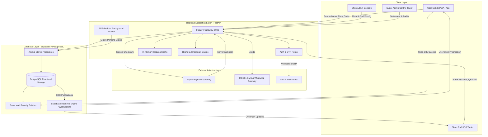
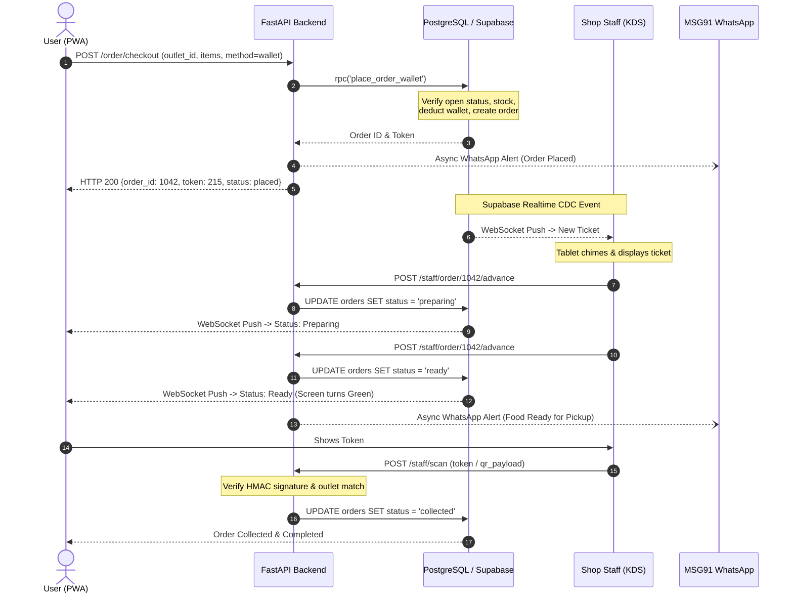
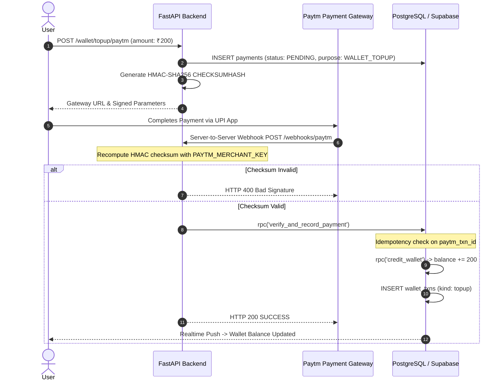

# V Foods: Backend and Database Architecture Specification

A comprehensive technical and functional reference for the V Foods campus dining and food court operating system.

---

## 1. Executive Summary & Project Vision

### 1.1 The Campus Dining Problem
At universities and high-density campuses, dining operations face extreme surge patterns. When lectures conclude, thousands of campus users converge upon food courts, dining halls, and canteens simultaneously during a narrow 15-to-30 minute window.

Traditional campus food ordering suffers from four critical failures:
1. **Physical Counter Congestion**: Users spend 10 to 20 minutes waiting in queue simply to place an order and pay, followed by another 10 to 15 minutes waiting near the counter for their food.
2. **Payment & Cash Friction**: Cash transactions cause coin shortages and slow counter throughput. Card terminals often drop connections indoors. Ad-hoc UPI scanning leads to unverified transfers, falsified screenshots, and lost revenue.
3. **Kitchen Operational Chaos**: Kitchen staff rely on handwritten paper tickets or noisy thermal slips that get lost, grease-stained, or prepared out of sequence.
4. **Inventory and Settlement Discrepancies**: Out-of-stock items continue to be ordered, leading to awkward cancellations and counter disputes. At the end of each day, reconciling revenue between shop owners, campus administration, and service operators is manual, error-prone, and contentious.

### 1.2 The V Foods Solution
**V Foods** is a high-concurrency, queue-free smart campus dining operating system. It coordinates the entire meal lifecycle across four distinct user roles:

```
[ User: Mobile Ordering & Wallet ]
                 |
                 v
[ FastAPI Backend: Verification, Caching, Payments ]
                 |
                 v
[ Supabase PostgreSQL: Atomic Transactions, RLS, Realtime Engine ]
                 |
                 +-----------------------+-----------------------+
                 |                       |                       |
                 v                       v                       v
      [ Shop Staff: Live KDS ]   [ Shop Admin: Ops ]   [ Super Admin: Governance ]
                 |
                 v
  [ Cryptographic QR Verification & Handover ]
```

- **Instant Mobile Ordering**: Users browse live menus, see real-time availability, and order ahead from their devices.
- **Dual Payment Rails**: Users pay either in milliseconds using their prepaid campus wallet or directly via payment gateway (Paytm / UPI).
- **Paperless Kitchen Display System (KDS)**: Kitchens receive orders instantly via real-time WebSockets with live status progression (`Placed` -> `Preparing` -> `Ready` -> `Collected`).
- **Cryptographic Pickup Verification**: Food handover is authenticated using 3-digit daily tokens or HMAC-SHA256 signed QR pickup passes, eliminating stolen food and incorrect handovers.
- **Automated Three-Way Revenue Settlement**: Every completed meal automatically computes and records compliant revenue splits (90% to the Food Shop, 5% to the V Foods Platform, 5% to the University Campus) with zero-penny rounding conservation.

---

## 2. High-Level System Architecture

The V Foods architecture is designed as a decoupled, asynchronous, and resilient distributed system:



---

## 3. Backend Technologies & Tools Explained

Every tool in the V Foods backend is selected for high concurrency, low latency, data integrity, and enterprise security.

### 3.1 FastAPI (Python 3.11)
- **What it is**: A modern, high-performance web framework for building APIs with Python based on standard Python type hints.
- **Role in V Foods**: Acts as the central business logic coordinator, security perimeter, and external integration gateway.
- **Why it was chosen**:
  - **Asynchronous Execution (`async`/`await`)**: Built on top of Starlette and AnyIO, FastAPI handles thousands of concurrent non-blocking requests with minimal CPU and memory footprints.
  - **Native OpenAPI & JSON Schema**: Generates interactive documentation (`/docs`) and typed client schemas automatically.
  - **Dependency Injection System**: Centralizes role-based authorization guards (`get_current_user`, `require_staff`, `require_shop_admin`, `require_admin`).

### 3.2 Uvicorn
- **What it is**: An ultra-fast ASGI (Asynchronous Server Gateway Interface) web server implementation for Python.
- **Role in V Foods**: The production application server running the FastAPI application.
- **Why it was chosen**: Built on `uvloop` (a fast, drop-in replacement for `asyncio` implemented in Cython using `libuv`), Uvicorn delivers raw throughput comparable to Go and Node.js.

### 3.3 Pydantic (v2)
- **What it is**: A data validation and parsing library written in Rust for Python.
- **Role in V Foods**: Validates incoming HTTP payloads, query parameters, and headers before business logic executes.
- **Why it was chosen**: Pydantic v2 enforces strict type contracts, prevents injection attacks, sanitizes inputs, and runs data parsing up to 20 times faster than Pydantic v1.

### 3.4 Supabase Python Client (`supabase-py`)
- **What it is**: The official Python client for interacting with Supabase services.
- **Role in V Foods**: Executes database queries, invokes PostgreSQL stored procedures (RPCs), and manages administrative database calls using the `SUPABASE_SERVICE_ROLE_KEY`.
- **Why it was chosen**: Provides a clean interface for executing complex SQL procedures while maintaining connection pooling to Supabase. The service role key is kept strictly within the backend and is never exposed to client browsers.

### 3.5 Python-Jose & JWT Authentication
- **What it is**: A JavaScript Object Signing and Encryption (JOSE) implementation in Python.
- **Role in V Foods**: Decodes, validates, and cryptographically verifies Supabase JSON Web Tokens (JWTs) presented in the `Authorization: Bearer <token>` HTTP header.
- **Why it was chosen**: Verifies user identity, issuer, expiration, and role claims statelessly without requiring a database query on every protected endpoint.

### 3.6 APScheduler (Advanced Python Scheduler)
- **What it is**: An in-process, asynchronous task scheduling library for Python.
- **Role in V Foods**: Runs background jobs at fixed intervals directly within the FastAPI event loop.
- **Core Task**:
  - **`expire_pending_orders`**: Runs every 5 minutes. Scans for orders that were initiated via payment gateway but never paid within the expiration window. It marks them `cancelled` and returns temporarily held inventory back to the menu.

### 3.7 HTTPX
- **What it is**: A fully featured, asynchronous HTTP client for Python 3 with HTTP/1.1 and HTTP/2 support.
- **Role in V Foods**: Handles outgoing HTTP requests from the backend to external third-party services:
  - Communicating with the Paytm Payment Gateway.
  - Dispatching transactional SMS and WhatsApp notifications to MSG91.

### 3.8 Cryptography & HMAC-SHA256 Engine
- **What it is**: Python's standard `hmac` and `hashlib` modules along with the `cryptography` library.
- **Role in V Foods**:
  - **Paytm Checksum Generation & Verification**: Calculates and verifies HMAC-SHA256 signatures for every payment transaction and incoming webhook.
  - **QR Pickup Pass Signing**: Generates tamper-proof QR payload signatures (`order:<id>:<hmac_hex>`) using a server-side secret key (`QR_SECRET`).
  - **Timing-Attack Resistance**: Uses `hmac.compare_digest` for all signature evaluations to prevent timing attacks.

### 3.9 In-Memory Catalog Caching
- **What it is**: A high-speed caching layer maintained in FastAPI memory (`_CATALOG_CACHE`).
- **Role in V Foods**: Caches the status and summary list of all campus dining outlets (`/api/catalog/summary`) with a 30-second Time-To-Live (TTL).
- **Why it was chosen**: When 1,000+ campus users open the app simultaneously during break, cached catalog requests are served in under 2 milliseconds without querying the database, eliminating database connection exhaustion.

### 3.10 SMTP & Email OTP Verification System
- **What it is**: An email delivery pipeline utilizing Python's `smtplib`, `email.mime`, and `secrets` module.
- **Role in V Foods**: Generates, rate-limits, and verifies 6-digit numeric OTP codes during user signup.
- **Security Features**:
  - 10-minute code expiration.
  - 30-second cooldown between resend requests.
  - 5-attempt brute-force protection lockout.
  - Fallback logging mode for local development and sandbox environments.

### 3.11 MSG91 WhatsApp & SMS Integration
- **What it is**: An enterprise cloud communication platform.
- **Role in V Foods**: Delivers automated, fire-and-forget WhatsApp notifications to users at key moments:
  - Top-up confirmed.
  - Order placed with 3-digit pickup token.
  - Food ready for collection at the counter.
  - Order cancellation or payment failure notification.

---

## 4. Database Architecture (Supabase / PostgreSQL)

The V Foods database is hosted on Supabase and powered by PostgreSQL. It uses relational schemas, constraints, atomic stored procedures, and Row-Level Security (RLS) to enforce data integrity and tenant isolation.

### 4.1 Complete Entity Relationship Diagram (ERD)

```
                    +--------------------------------+
                    |            outlets             |
                    +--------------------------------+
                                   | 1
                                   |
              +--------------------+--------------------+
              | 1                                       | 1
              v 1                                       v *
+--------------------------------+               +--------------------+
|     outlet_paytm_accounts      |               |     menu_items     |
| (per-shop split % & sub-acct)  |               +--------------------+
+--------------------------------+                         |
              ^                                         |
              |                                         v *
              | 1                            +----------------------+
              |                              |     order_items      |
              |                              +----------------------+
              |                                         ^ *
              |                                         | 1
+--------------------------------+               +--------------------+
|         payment_splits         | *           1 |       orders       |
|   (SHOP / PLATFORM / COLLEGE)  |-------------->| (token, status,    |
+--------------------------------+               |  shop_payout, total|
              | *                                |  payment_id FK)    |
              v 1                                +--------------------+
+--------------------------------+                         | 1
|            payments            |<------------------------+
| (Paytm direct order & top-up)  |
+--------------------------------+
              | 1
              v *
+--------------------------------+
|            refunds             |
+--------------------------------+
```

---

### 4.2 Comprehensive Table Specifications

#### 1. `outlets`
Stores all dining facilities, canteens, cafes, and event stalls across the campus.
- `id` (`text`, Primary Key): Machine identifier (e.g., `'main-canteen'`, `'gazebo-c1'`).
- `name` (`text`, NOT NULL): Human-readable display name.
- `location` (`text`, NOT NULL): Physical campus building or zone.
- `is_event` (`boolean`, DEFAULT `false`): Flags temporary festival food stalls.
- `is_open` (`boolean`, DEFAULT `true`): Live operational switch.

#### 2. `menu_items`
Holds all dishes, drinks, and meals available across outlets.
- `id` (`bigint`, Identity PK): Unique food item identifier.
- `outlet_id` (`text`, FK `outlets.id` ON DELETE CASCADE): Outlet ownership.
- `name` (`text`, NOT NULL): Item title.
- `price` (`int`, CHECK `price > 0`): Base price in Indian Rupees (INR).
- `available` (`boolean`, DEFAULT `true`): Immediate stock availability toggle.
- `is_veg` (`boolean`, DEFAULT `true`): Dietary badge.
- `category` (`text`, DEFAULT `'General'`): Grouping category (e.g., `'Meals'`, `'Snacks'`).
- `available_from` / `available_to` (`time`, NULL): Time window restrictions.
- `stock_qty` (`int`, NULL): Remaining portion count. `NULL` denotes unlimited.
- `reserved_qty` (`int`, DEFAULT `0`): Portions locked during pending checkouts.

#### 3. `profiles`
User accounts extending Supabase's native `auth.users` authentication table.
- `id` (`uuid`, PK, FK `auth.users.id` ON DELETE CASCADE): User identity.
- `full_name` (`text`, DEFAULT `''`): User's legal name.
- `role` (`user_role` ENUM): Role authorization (`'customer'`, `'staff'`, `'shop_admin'`, `'super_admin'`, `'admin'`).
- `cust_type` (`cust_type` ENUM): Campus user classification (`'student'`, `'faculty'`, `'visitor'`).
- `outlet_id` (`text`, NULL, FK `outlets.id`): Outlet assignment for staff and shop owners.
- `phone` (`text`, NULL): Normalized phone number for notifications.
- `created_at` (`timestamptz`, DEFAULT `now()`).

#### 4. `wallets`
Prepaid digital campus wallet balances.
- `user_id` (`uuid`, PK, FK `profiles.id` ON DELETE CASCADE): Wallet owner.
- `balance` (`int`, DEFAULT `0`, CHECK `balance >= 0`): Stored balance in INR. Cannot be negative.
- `updated_at` (`timestamptz`, DEFAULT `now()`).

#### 5. `wallet_txns`
Immutable double-entry transaction ledger tracking every balance change.
- `id` (`bigint`, Identity PK): Ledger transaction ID.
- `user_id` (`uuid`, FK `profiles.id` ON DELETE CASCADE): Wallet owner.
- `amount` (`int`): Change in INR. Positive for credits/top-ups, negative for purchases.
- `kind` (`text`, CHECK in `'topup'`, `'order'`, `'refund'`, `'admin_credit'`): Transaction type.
- `ref` (`text`, UNIQUE): Idempotency key (e.g. `'paytm:TXN9876'`, `'order:1042'`).
- `note` (`text`, NULL): Audit explanation.
- `created_at` (`timestamptz`, DEFAULT `now()`).

#### 6. `orders`
Master record for every meal placed on the platform.
- `id` (`bigint`, Identity PK): Global order identifier.
- `user_id` (`uuid`, FK `profiles.id` ON DELETE RESTRICT): Purchasing user.
- `outlet_id` (`text`, FK `outlets.id` ON DELETE RESTRICT): Fulfilling outlet.
- `token` (`text`, NULL): 3-digit daily counter pickup code (e.g. `'142'`).
- `status` (`order_status` ENUM): Current state (`'payment_pending'`, `'placed'`, `'preparing'`, `'ready'`, `'collected'`, `'cancelled'`).
- `payment_method` (`payment_method` ENUM): Payment channel (`'wallet'`, `'gateway'`).
- `shop_payout` (`int`, CHECK `shop_payout > 0`): Net subtotal for food items.
- `total` (`int`, CHECK `total > 0`): Final user bill including convenience fees.
- `my_profit` (`int`, GENERATED ALWAYS AS `(shop_payout * 5 / 100)` STORED): Platform fee.
- `payment_id` (`bigint`, NULL, FK `payments.id`): Associated payment record.
- `cancel_reason` (`text`, NULL): Reason recorded if cancelled.
- `expires_at` (`timestamptz`, NULL): Automatic cancellation deadline for pending payments.
- `created_at` / `updated_at` (`timestamptz`, DEFAULT `now()`).

#### 7. `order_items`
Individual line items inside an order with frozen price snapshots.
- `order_id` (`bigint`, FK `orders.id` ON DELETE CASCADE).
- `item_id` (`bigint`, FK `menu_items.id` ON DELETE RESTRICT).
- `name` (`text`): Frozen item title at time of purchase.
- `price` (`int`): Frozen unit price at time of purchase.
- `qty` (`int`, CHECK `qty > 0`): Ordered quantity.
- Primary Key: `(order_id, item_id)`.

#### 8. `payments`
Unified ledger of all payment transactions across both top-ups and direct order checkouts.
- `id` (`bigint`, Identity PK): Unified payment ID.
- `user_id` (`uuid`, FK `profiles.id` ON DELETE RESTRICT).
- `order_id` (`bigint`, NULL, FK `orders.id` ON DELETE SET NULL).
- `wallet_txn_id` (`bigint`, NULL, FK `wallet_txns.id` ON DELETE SET NULL).
- `amount` (`numeric`, CHECK `amount > 0`): Total amount processed.
- `payment_purpose` (`text`, CHECK `'ORDER'`, `'WALLET_TOPUP'`).
- `payment_method` (`text`, CHECK `'UPI_ID'`, `'UPI_APP'`, `'UPI_QR'`, `'DEBIT_CARD'`, `'CREDIT_CARD'`, `'WALLET'`).
- `status` (`text`, DEFAULT `'PENDING'`, CHECK `'PENDING'`, `'SUCCESS'`, `'FAILED'`, `'CANCELLED'`, `'REFUNDED'`).
- `paytm_order_id` (`text`, NULL): Merchant order reference sent to gateway.
- `paytm_txn_id` (`text`, NULL, UNIQUE): Bank transaction ID used as idempotency key.
- `paid_at` (`timestamptz`, NULL): Completion timestamp.
- `failure_reason` (`text`, NULL): Gateway error response if unsuccessful.

#### 9. `outlet_paytm_accounts`
Per-shop recipient sub-accounts for automated revenue disbursement.
- `outlet_id` (`text`, PK, FK `outlets.id` ON DELETE CASCADE).
- `paytm_account_id` (`text`, NOT NULL): Shop owner's registered gateway merchant ID.
- `onboarding_status` (`text`, DEFAULT `'PENDING'`, CHECK `'PENDING'`, `'ACTIVE'`, `'REJECTED'`).
- `settlement_enabled` (`boolean`, DEFAULT `false`).
- `shop_split_percentage` (`numeric`, DEFAULT `90`, CHECK `BETWEEN 0 AND 100`).

#### 10. `platform_settlement_account`
Master settlement account for the V Foods operating company (singleton row `id = 1`).
- `id` (`int`, PK, CHECK `id = 1`).
- `paytm_account_id` (`text`, NOT NULL): Company settlement merchant ID.
- `platform_split_percentage` (`numeric`, DEFAULT `5`, CHECK `BETWEEN 0 AND 100`).

#### 11. `college_settlement_accounts`
University institution settlement account for host campus royalties.
- `id` (`bigint`, Identity PK).
- `campus_name` (`text`, NOT NULL): Campus title (e.g. `'VIT Chennai'`).
- `paytm_account_id` (`text`, NOT NULL): Institutional account ID.
- `is_active` (`boolean`, DEFAULT `true`): Enforced singleton via unique partial index.
- `college_split_percentage` (`numeric`, DEFAULT `5`, CHECK `BETWEEN 0 AND 100`).

#### 12. `payment_splits`
Individual accounting splits generated for every completed meal.
- `id` (`bigint`, Identity PK).
- `payment_id` (`bigint`, FK `payments.id` ON DELETE CASCADE).
- `recipient_type` (`text`, CHECK `'SHOP'`, `'PLATFORM'`, `'COLLEGE'`).
- `outlet_paytm_account_id` (`text`, NULL, FK `outlet_paytm_accounts.outlet_id`).
- `platform_account_id` (`int`, NULL, FK `platform_settlement_account.id`).
- `college_account_id` (`bigint`, NULL, FK `college_settlement_accounts.id`).
- `split_amount` (`numeric`, CHECK `split_amount >= 0`).
- `split_percentage` (`numeric`, CHECK `BETWEEN 0 AND 100`).
- `settlement_status` (`text`, DEFAULT `'PENDING'`, CHECK `'PENDING'`, `'SETTLED'`, `'FAILED'`).
- `settlement_reference` (`text`, NULL): Bank disbursement reference code.

#### 13. `refunds`
Audit log of processed and pending customer refunds.
- `id` (`bigint`, Identity PK).
- `payment_id` (`bigint`, FK `payments.id` ON DELETE RESTRICT).
- `order_id` (`bigint`, NULL, FK `orders.id`).
- `refund_type` (`text`, CHECK `'ORDER_REFUND'`, `'WALLET_TOPUP_REFUND'`, `'SPLIT_REFUND'`).
- `amount` (`numeric`, CHECK `amount > 0`).
- `status` (`text`, DEFAULT `'PENDING'`, CHECK `'PENDING'`, `'SUCCESS'`, `'FAILED'`).
- `paytm_refund_id` (`text`, NULL).

#### 14. `audit_logs`
Forensic security ledger recording administrative and operational adjustments.
- `id` (`bigint`, Identity PK).
- `user_id` (`uuid`, FK `profiles.id`).
- `action` (`text`, NOT NULL): Action identifier (e.g. `'PRICE_CHANGE'`, `'STOCK_OVERRIDE'`).
- `entity_type` (`text`, NOT NULL): Target entity (`'menu_item'`, `'outlet'`).
- `entity_id` (`text`, NOT NULL).
- `details` (`jsonb`): State diff containing before and after values.
- `created_at` (`timestamptz`, DEFAULT `now()`).

#### 15. `invites`
Cryptographically generated single-use codes for onboarding kitchen staff and shop managers.
- `id` (`bigint`, Identity PK).
- `code` (`text`, UNIQUE, NOT NULL): 8-character uppercase hex token.
- `role` (`text`, CHECK in `'staff'`, `'shop_admin'`).
- `outlet_id` (`text`, FK `outlets.id`).
- `status` (`text`, DEFAULT `'pending'`, CHECK in `'pending'`, `'accepted'`, `'revoked'`).
- `invited_by` (`uuid`, FK `profiles.id`).
- `accepted_by` (`uuid`, NULL, FK `profiles.id`).

#### 16. `settings`
Global system configuration parameters.
- `key` (`text`, PK): Parameter key (e.g. `'event_mode_enabled'`).
- `value` (`jsonb`): Stored configuration payload.

---

### 4.3 Stored Procedures & Business Functions

V Foods executes critical business logic directly within PostgreSQL stored procedures to guarantee atomic execution and prevent race conditions.

#### `place_order_wallet(p_user_id, p_outlet_id, p_items)`
- **Purpose**: Atomically executes wallet-based order placement inside a single SQL transaction.
- **Workflow**:
  1. Verifies that the target outlet is currently open.
  2. Queries official menu item prices directly from `menu_items` (client-provided prices are ignored to prevent price tampering).
  3. Verifies that every item has sufficient available stock (`stock_qty >= qty`).
  4. Computes item subtotal and 5% platform fee.
  5. Verifies the user's wallet balance (`balance >= total`).
  6. Deducts the total amount from `wallets`.
  7. Inserts a debit record into `wallet_txns` with an idempotency key.
  8. Decrements item stock in `menu_items`. If an item hits zero, automatically sets `available = false`.
  9. Generates a fresh 3-digit pickup token (100 to 999).
  10. Inserts the order into `orders` and order lines into `order_items`.
  11. Returns the created `order_id`. If any check fails, the entire transaction rolls back with zero state modification.

#### `credit_wallet(p_user_id, p_amount, p_kind, p_ref, p_note)`
- **Purpose**: Safely adds funds to a user's wallet with idempotency enforcement.
- **Workflow**:
  1. Checks `wallet_txns` for existing reference key `p_ref`.
  2. If `p_ref` already exists, exits immediately without modifying balance (idempotency guard against duplicate webhooks).
  3. Updates `wallets` balance by adding `p_amount`.
  4. Inserts an audit credit record into `wallet_txns`.

#### `verify_and_record_payment(p_paytm_txn_id, p_status, p_paytm_order_id, ...)`
- **Purpose**: Idempotently processes payment status updates received via verified payment webhooks.
- **Workflow**:
  1. Looks up the matching pending payment record.
  2. If the payment was already marked `SUCCESS`, returns immediately.
  3. Updates payment status, bank transaction ID, and timestamp.
  4. For `WALLET_TOPUP`: Invokes `credit_wallet()` to credit the user's balance.
  5. For `ORDER`: Confirms the order status as `placed`, generates the pickup token, and calls `calculate_order_split()`.

#### `calculate_order_split(p_order_id, p_payment_id)`
- **Purpose**: Computes and records the compliant three-way revenue distribution on completed meal orders.
- **Workflow**:
  1. Retrieves configured split percentages from `outlet_paytm_accounts`, `platform_settlement_account`, and `college_settlement_accounts`.
  2. Computes the Shop share: `floor(shop_payout * (shop_pct / 100))`.
  3. Computes the Platform share: `floor(shop_payout * (platform_pct / 100))`.
  4. Computes the College share using the exact residual difference:
     $$\text{College Share} = \text{shop\_payout} - \text{Shop Share} - \text{Platform Share}$$
     This mathematical guarantee ensures zero rounding leakage and exact penny conservation.
  5. Inserts the three split records into `payment_splits`.

#### `expire_pending_orders()`
- **Purpose**: Batch maintenance routine executed by APScheduler every 5 minutes.
- **Workflow**:
  1. Finds orders in `payment_pending` status whose `expires_at` timestamp has passed.
  2. Releases reserved stock back to `menu_items`.
  3. Updates order status to `cancelled` with reason `'Payment session expired'`.
  4. Returns the count of cancelled orders.

---

### 4.4 Database Security: Row-Level Security (RLS)

In V Foods, security boundaries are enforced inside the database engine using PostgreSQL Row-Level Security. Every table has explicit RLS policies enabled.

```
+-----------------------------------------------------------------------------+
|                     PostgreSQL Database Engine (RLS)                       |
+-----------------------------------------------------------------------------+
   |
   +--> User Role Policy:
   |    - Can SELECT and UPDATE ONLY rows where `user_id = auth.uid()`
   |    - Cannot read other users' orders, wallet balances, or transactions
   |
   +--> Shop Staff Policy:
   |    - Can SELECT and UPDATE orders ONLY where `outlet_id = my_outlet_id()`
   |    - Kitchen staff at Gazebo C1 cannot view orders for North Square
   |
   +--> Shop Admin Policy:
   |    - Can read and update menu items, stock, and staff for own outlet
   |    - Can view revenue splits ONLY for their own shop
   |
   +--> Super Admin Policy:
        - Full platform read/write access across all outlets, campuses, and logs
```

- **Client Price Isolation**: Client applications cannot supply prices or alter orders directly.
- **Cardholder Security**: No credit card PANs, CVVs, expiration dates, or bank PINs are stored in the database.
- **Audit Immutability**: The `wallet_txns`, `audit_logs`, and `payment_splits` tables have strict append-only rules. `UPDATE` and `DELETE` operations are revoked.

---

## 5. End-to-End Operational Lifecycle

### 5.1 The Order Journey: From Selection to Counter Handover



### 5.2 The Payment Journey: Wallet Top-Up & Three-Way Split



---

## 6. API Reference Summary

| Method | Endpoint | Access Role | Description |
|---|---|---|---|
| `GET` | `/` | Public | Service heartbeat and API metadata |
| `GET` | `/health` | Public | Health status and database connectivity check |
| `GET` | `/api/catalog/summary` | Public | High-concurrency cached catalog of campus outlets |
| `POST` | `/api/auth/send-otp` | Public | Dispatches 6-digit verification code via SMTP |
| `POST` | `/api/auth/verify-otp` | Public | Validates verification code with brute-force lockout |
| `POST` | `/wallet/topup` | User | Initiates PhonePe wallet top-up session |
| `POST` | `/wallet/topup/paytm` | User | Initiates Paytm wallet top-up with signed checksum |
| `POST` | `/order/checkout` | User | Atomic order placement (Prepaid Wallet or Gateway) |
| `POST` | `/order/checkout/paytm-session` | User | Initiates direct Paytm checkout session |
| `POST` | `/webhooks/phonepe` | External Webhook | Idempotent callback handler for PhonePe transactions |
| `POST` | `/webhooks/paytm` | External Webhook | Cryptographically verified callback handler for Paytm |
| `POST` | `/staff/order/{id}/advance` | Staff / Shop Admin | Advances order status (`placed` -> `preparing` -> `ready`) |
| `POST` | `/staff/order/{id}/cancel` | Staff / Shop Admin | Cancels order and triggers automated refund |
| `POST` | `/staff/scan` | Staff / Shop Admin | Validates signed QR pass or 3-digit token at counter |
| `POST` | `/staff/stock/adjust` | Staff / Shop Admin | Modifies item portion count and logs audit adjustment |
| `POST` | `/admin/invites/create` | Shop Admin / Admin | Generates single-use invite code for staff onboarding |
| `POST` | `/invites/accept` | Authenticated User | Redeems invite code to link profile to staff/outlet role |
| `POST` | `/admin/credit-wallet` | Super Admin | Administrative wallet balance credit with audit note |

---

## 7. Production Deployment & Reliability

### 7.1 Deployment Configuration
- **Application Gateway**: Hosted on Render as a high-availability Web Service with automatic SSL/TLS termination.
- **Container Environment**: Python 3.11 with dependencies pinned in `backend/requirements.txt`.
- **Database Engine**: Managed Supabase PostgreSQL with high-availability read replicas and automated daily backups.

### 7.2 Zero-Trust Security Summary
1. **No Shared Passwords**: Staff and owners join via cryptographic single-use invitation tokens.
2. **Authoritative Server Pricing**: Client applications never compute or submit monetary amounts. All totals are derived from database records.
3. **Signed Webhooks**: External payment callbacks without matching HMAC-SHA256 signatures are immediately rejected.
4. **Isolated Database Tenancy**: Database Row-Level Security guarantees that no role can inspect or tamper with records outside their authorized scope.
