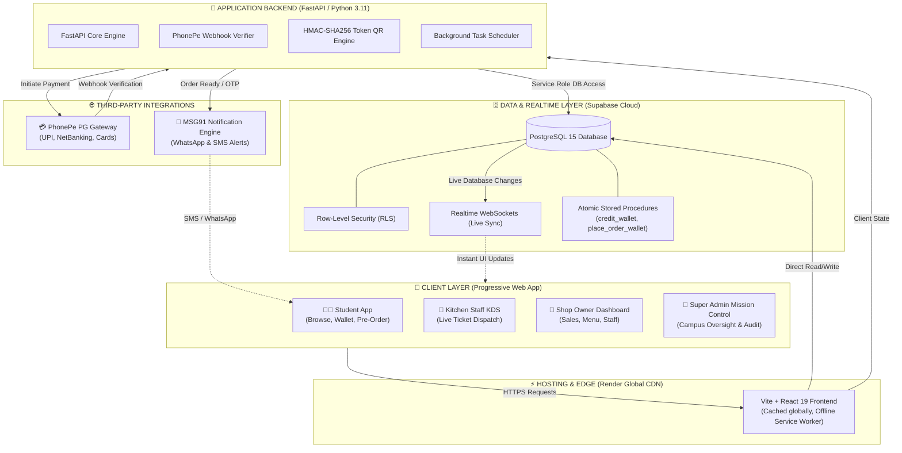
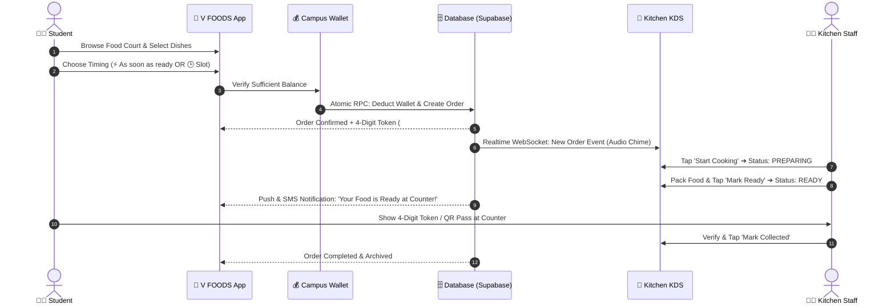
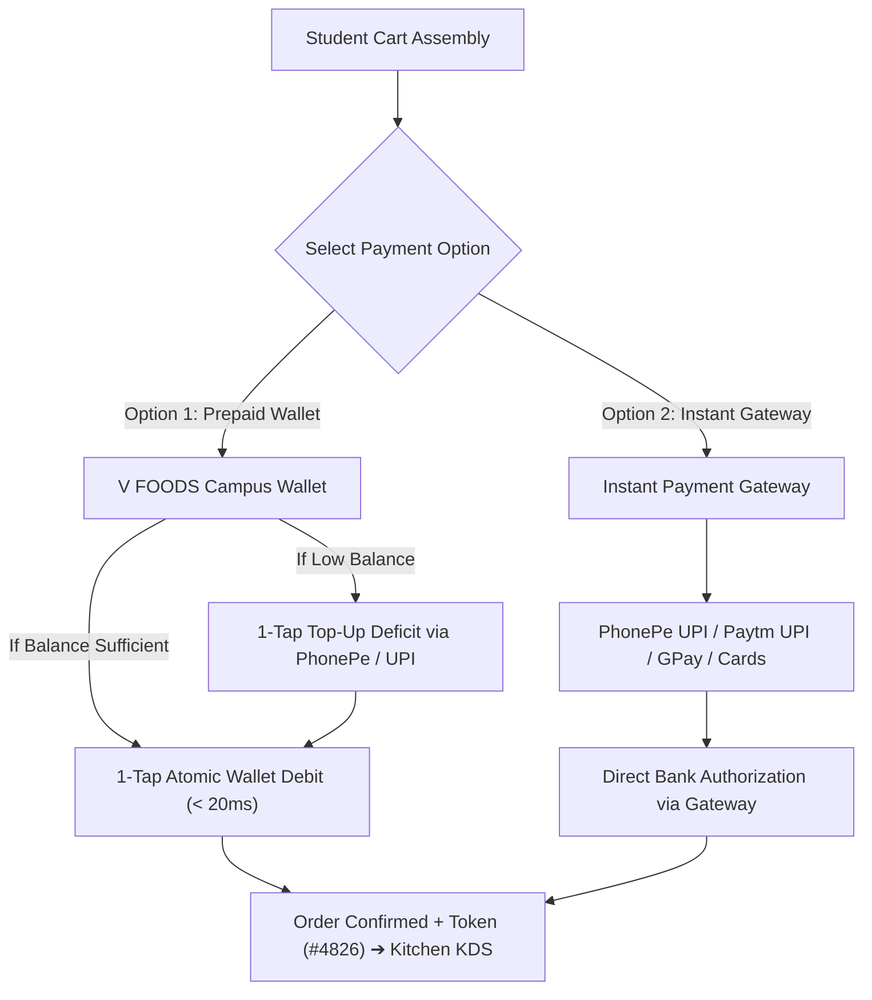
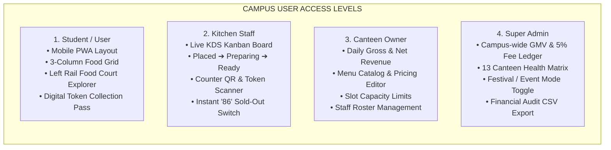
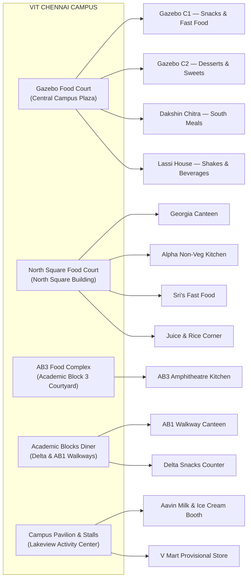

# V FOODS — Complete Campus Dining & Pre-Order System Guide

> **A plain-English operational and architectural guide to the V FOODS platform.**  
> Designed for students, canteen franchisees, university dining administrators, and technical partners.

---

## Table of Contents
1. [What is V FOODS?](#1-what-is-v-foods)
2. [Full-Mode System Architecture](#2-full-mode-system-architecture)
3. [The End-to-End Order Lifecycle](#3-the-end-to-end-order-lifecycle)
4. [Wallet-First Payment Architecture](#4-wallet-first-payment-architecture)
5. [The Four Specialized Dashboards](#5-the-four-specialized-dashboards)
6. [Campus Canteens & Food Courts](#6-campus-canteens--food-courts)
7. [Database Security & Row-Level Isolation (RLS)](#7-database-security--row-level-isolation-rls)
8. [Production Deployment & Infrastructure](#8-production-deployment--infrastructure)

---

## 1. What is V FOODS?

**V FOODS** is a smart food pre-ordering, prepaid digital wallet, and kitchen management platform custom-built for collegiate campuses and large festival dining grids. 

### The Problem on Campus
During 15-minute lecture breaks and lunch rush hours:
- Hundreds of students crowd physical canteen counters simultaneously.
- Payment terminals fail due to mobile network congestion or UPI timeouts.
- Counter lines move slowly while cashiers manually handle payments, verify slips, and call out orders.
- Students spend 25–40 minutes waiting in line, often missing meals or arriving late to classes.

### The V FOODS Solution
1. **Pre-Order Ahead**: Students browse menus, customize items, and place pre-orders before walking to the food court.
2. **Prepaid Digital Wallet**: Payments are deducted in **under 20 milliseconds** from a pre-loaded campus wallet, eliminating checkout failure rates.
3. **Kitchen Display System (KDS)**: Kitchen staff receive orders digitally on a live board, prepare meals in advance, and package them hot.
4. **Instant Token Counter Collection**: Students receive a **4-digit digital token** (e.g. `#4826`) and QR pass. They arrive at the counter, show their token, pick up their hot meal in seconds, and leave. **Zero waiting in lines.**

---

## 2. Full-Mode System Architecture

The following diagram illustrates how all components of V FOODS communicate in real time across the university network:



---

## 3. The End-to-End Order Lifecycle

Every pre-order follows a structured 4-step pipeline designed for zero physical friction:



---

## 4. Dual Payment Architecture: Wallet + Instant Gateway

V FOODS provides flexible dual payment channels right at the checkout counter:



### Payment Option Comparison:
| Feature | Option A: V FOODS Campus Wallet | Option B: Instant Payment Gateway |
| :--- | :--- | :--- |
| **Best For** | Daily meals, regular students, 10-min rush breaks | Visitors, first-time students, direct bank payers |
| **Speed** | **Under 20 milliseconds (Fastest)** | 5–15 seconds (Standard UPI app authorization) |
| **Prerequisites** | Pre-loaded wallet balance (rechargeable anytime) | None; works with zero prior balance |
| **Providers** | Internal wallet float (recharged via PhonePe/UPI) | PhonePe, Paytm, Google Pay, BHIM, Cards |
| **Network Reliability** | Works seamlessly even with spotty campus signals | Requires active mobile internet to authorize UPI |
| **Deficit Support** | Auto-calculated deficit top-up (+ ₹X & Pay) | Not needed — charges exact order total directly |

---

## 5. The Four Specialized Dashboards

V FOODS provides 4 distinct interfaces tailored to specific responsibilities:



---

## 6. Campus Canteens & Food Courts

V FOODS models the physical layout of **VIT Chennai** into **5 Major Food Courts** housing **13 distinct counters**:



---

## 7. Database Security & Row-Level Isolation (RLS)

All permissions in V FOODS are secured directly by **PostgreSQL Row-Level Security (RLS)** in Supabase. The database rejects unauthorized queries at the engine level:

```
┌────────────────────────────────────────────────────────────────────────┐
│                        SUPABASE POSTGRESQL ENGINE                      │
├────────────────────────────────────────────────────────────────────────┤
│  STUDENTS      ➔ Read only own profile, wallet transactions, orders    │
│  KITCHEN STAFF ➔ Read and update orders belonging strictly to OUTLET_ID │
│  CANTEEN OWNER ➔ Edit menu, view revenue strictly for their OUTLET_ID  │
│  SUPER ADMIN   ➔ Full platform visibility and governance               │
└────────────────────────────────────────────────────────────────────────┘
```

Even if someone tampers with frontend code or runs unauthorized network commands, the database automatically filters out and blocks any record outside the user's validated session token.

---

## 8. Production Deployment & Infrastructure

V FOODS is deployed using automated continuous deployment on **Render.com**:

- **Frontend (`vfoods-web`)**:
  - React 19 + Vite PWA static site deployed globally via Render's CDN.
  - Automatically rebuilds on git pushes to `main`.
- **Backend API (`vfoods-api`)**:
  - Python 3.11 FastAPI service deployed in the Singapore region (`uvicorn main:app`).
  - Connects to Supabase PostgreSQL via connection pooling and verifies PhonePe webhook signatures.
- **Database (`Supabase Cloud`)**:
  - Hosted PostgreSQL 15 instance with automatic failover, WAL replication, and real-time subscription hubs.
